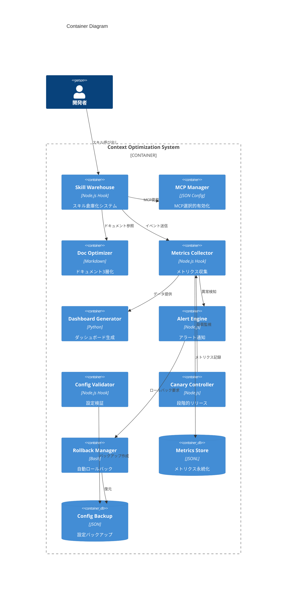
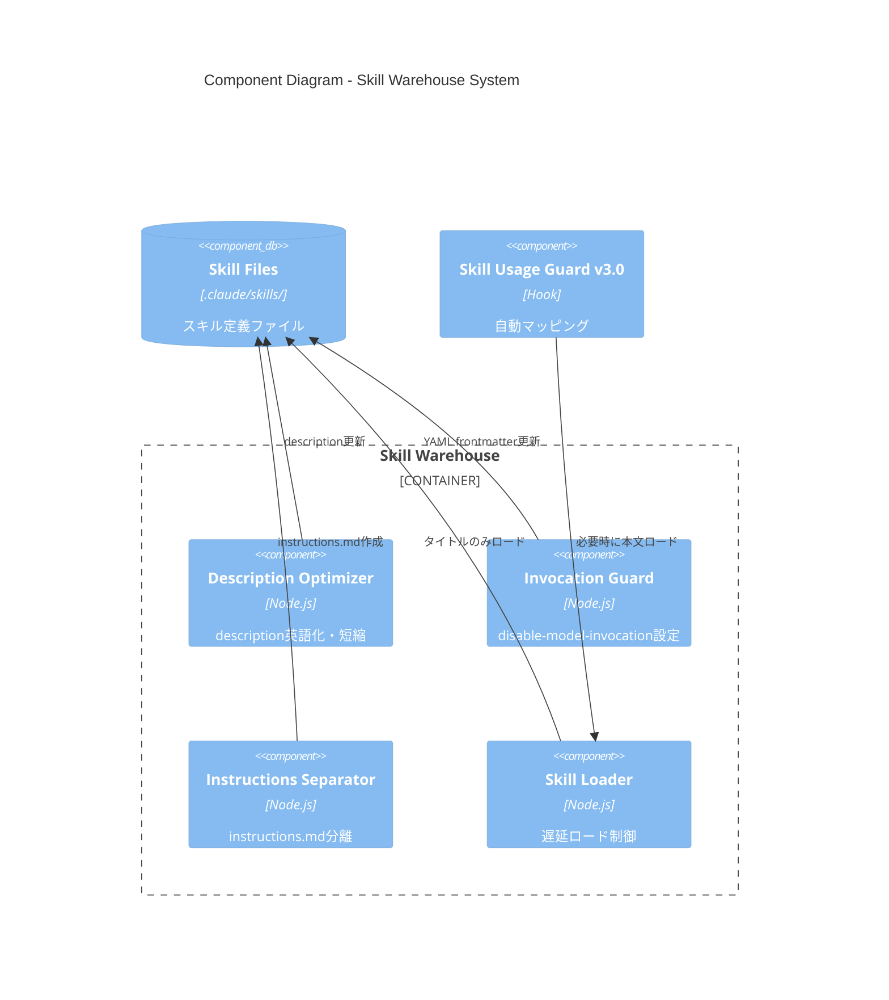
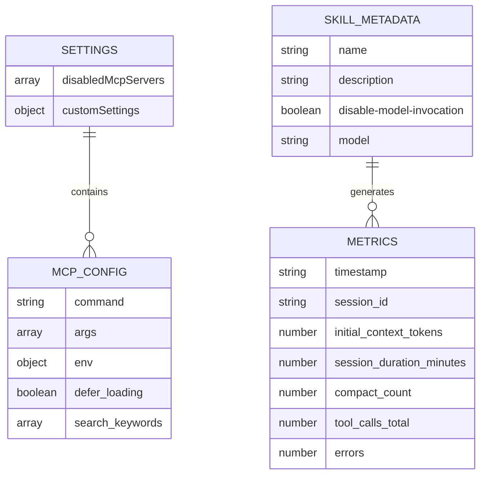

# Design: context-optimization

> C4モデルに基づく技術設計書。requirements.mdを実装可能な設計に落とし込む。

## 1. Context Diagram (Level 1)

### 1.1 システム概要
- **システム名**: Claude Code Context Optimization System
- **目的**: コンテキストウィンドウ消費を55%削減し、セッション継続時間を4倍に延長
- **主要ユーザー**: 開発者（Claude Codeユーザー）

### 1.2 外部アクター・システム

```mermaid
C4Context
    title System Context Diagram

    Person(developer, "開発者", "Claude Codeユーザー")
    System(claude_code, "Claude Code", "AIペアプログラミングCLI")

    System_Boundary(context_opt, "Context Optimization System") {
        Container(warehouse, "Warehouse System", "倉庫化管理")
        Container(monitor, "Monitoring System", "メトリクス収集・監視")
        Container(safety, "Safety System", "品質保証・ロールバック")
    }

    System_Ext(skills, "Skills (192)", "ユーザー定義スキル")
    System_Ext(mcp, "MCP Servers (26)", "MCP統合サービス")
    System_Ext(notification, "Notification", "Slack/Discord")

    Rel(developer, claude_code, "使用")
    Rel(claude_code, context_opt, "コンテキスト管理")
    Rel(context_opt, skills, "遅延ロード")
    Rel(context_opt, mcp, "選択的有効化")
    Rel(context_opt, notification, "アラート送信")
```

| アクター/システム | 種別 | 役割 | 通信方式 |
|------------------|------|------|---------|
| 開発者 | User | セッション実行、フィードバック | CLI |
| Claude Code | System | AIエージェント、ツール実行 | Hook経由 |
| Skills | External | タスク実行機能 | filesystem |
| MCP Servers | External | 外部連携機能 | JSON-RPC |
| Notification | External | アラート配信 | HTTP/WebSocket |

## 2. Container Diagram (Level 2)

### 2.1 コンテナ構成



### 2.2 コンテナ詳細

| コンテナ | 技術スタック | 責務 | スケーリング |
|---------|-------------|------|-------------|
| Skill Warehouse | Node.js (Hook) | スキル遅延ロード、description最適化 | - |
| MCP Manager | JSON Config | MCPサーバー選択的有効化、defer_loading | - |
| Doc Optimizer | Markdown | CLAUDE.md 3層分離、Progressive Disclosure | - |
| Metrics Collector | Node.js (Hook) | セッションメトリクス収集、JSONL記録 | - |
| Dashboard Generator | Python | 週次ダッシュボード生成、トレンド分析 | Cron |
| Alert Engine | Node.js | 異常検知、Slack/Discord通知 | イベント駆動 |
| Config Validator | Node.js (Hook) | JSON/YAMLバリデーション、Pre-commit | - |
| Canary Controller | Node.js | 10%→50%→100% 段階的リリース | - |
| Rollback Manager | Bash | 自動ロールバック、バックアップ復元 | - |
| Metrics Store | JSONL | コンテキストメトリクス永続化 | - |
| Config Backup | JSON | 設定ファイルバックアップ（世代管理） | - |

## 3. Component Diagram (Level 3)

### 3.1 Skill Warehouse コンポーネント



### 3.2 コンポーネント責務

| コンポーネント | 責務 | 依存関係 |
|---------------|------|---------|
| Description Optimizer | descriptionを英語化・50文字以内に短縮 | Skill Files |
| Invocation Guard | 手動呼び出しスキルにdisable-model-invocation設定 | Skill Files |
| Instructions Separator | 詳細説明をinstructions.mdに分離 | Skill Files |
| Skill Loader | スキル遅延ロード制御 | Skill Files |
| Skill Usage Guard | 自動マッピングシステム（既存） | Skill Loader |

## 4. API Contracts

### 4.1 Internal Hooks API

| Hook | Trigger | Input | Output |
|------|---------|-------|--------|
| `SessionStart:compact` | セッション開始時 | N/A | workflow状態注入 |
| `UserPromptSubmit:skill-usage-guard` | ユーザー入力時 | 入力テキスト | 必須スキル検出 |
| `PostToolUse:metrics-collector` | ツール実行後 | ツール名、パラメータ、結果 | メトリクス記録 |
| `Stop:session-end` | セッション終了時 | N/A | 最終メトリクス記録 |

### 4.2 Configuration Files

**`.claude/settings.json`**:
```json
{
  "disabledMcpServers": [
    "pexels",
    "pixabay",
    "puppeteer",
    "browser-use"
  ]
}
```

**`.mcp.json`** (既存):
```json
{
  "mcpServers": {
    "obsidian": {
      "defer_loading": true,
      "search_keywords": ["obsidian", "ノート", "知識"]
    }
  }
}
```

**Skill YAML Frontmatter**:
```yaml
---
name: mega-research-plus
description: 8-source integrated research system
disable-model-invocation: true
---
```

### 4.3 Metrics API

**`.claude/hooks/data/context-metrics.jsonl`**:
```jsonl
{"timestamp":"2026-02-15T10:00:00Z","session_id":"sess_001","initial_context_tokens":38000,"session_duration_minutes":135,"compact_count":1,"tool_calls_total":45,"errors":0}
```

| Field | Type | Description |
|-------|------|-------------|
| timestamp | ISO8601 | セッション終了時刻 |
| session_id | string | セッションID |
| initial_context_tokens | number | 初期コンテキスト消費 |
| session_duration_minutes | number | セッション継続時間 |
| compact_count | number | /compact実行回数 |
| tool_calls_total | number | ツール呼び出し総数 |
| errors | number | エラー発生数 |

## 5. Data Model

### 5.1 Config Schema



## 6. 技術選定理由（ADR参照）

| 決定 | 選択 | 理由 | ADR |
|------|------|------|-----|
| スキルdescription形式 | 英語 + 50文字制限 | トークン50%削減 | ADR-001 |
| スキル本文除外方式 | disable-model-invocation | タイトルのみロード | ADR-002 |
| 詳細説明分離方式 | instructions.md | /compact後の再ロード防止 | ADR-003 |
| ドキュメント構造 | Progressive Disclosure (3層) | 段階的情報開示 | ADR-004 |
| リリース方式 | Canary Release (10%→50%→100%) | リスク最小化 | ADR-005 |
| メトリクス保存形式 | JSONL | 追記専用、解析容易 | ADR-006 |

## 7. セキュリティ設計

### 7.1 認証・認可

| 方式 | 技術 | 用途 |
|------|------|------|
| ファイルアクセス制御 | macOS Permissions | スキル/設定ファイル保護 |
| Pre-commit Hook | JSON/YAML Validator | 不正設定のコミット拒否 |
| 監査ログ | append-only log | 設定変更履歴追跡 |

### 7.2 データ保護

| データ種別 | 保護方式 | 備考 |
|-----------|---------|------|
| APIキー・トークン | 環境変数のみ | `.gitignore`で除外 |
| メトリクスデータ | ローカルJSONL | 外部送信なし |
| 設定バックアップ | 世代管理（10世代） | `.claude/backups/` |

### 7.3 脅威対策（STRIDE対応）

| 脅威種別 | 対策 | 実装 |
|---------|------|------|
| Tampering（改ざん） | Pre-commit検証 | `config-validator.js` |
| Information Disclosure（漏洩） | 環境変数強制 | `secrets-guard.sh` |
| Denial of Service（DoS） | 自動ロールバック | `rollback-manager.sh` |
| Elevation of Privilege（権限昇格） | append-onlyログ | `audit.log` |

## 8. インフラ設計

### 8.1 環境構成

| 環境 | 用途 | 適用範囲 |
|------|------|---------|
| Local Development | 開発・テスト | `~/.claude/` |
| Canary (10%) | 初期検証 | ランダム10%のセッション |
| Canary (50%) | 拡大検証 | ランダム50%のセッション |
| Production (100%) | 全体適用 | 全セッション |

### 8.2 デプロイ構成

```
┌─────────────────────────────────────────────────────┐
│              Tier 1: 即効性施策                      │
│  ┌────────────┐  ┌────────────┐  ┌────────────┐   │
│  │description │  │disable-    │  │disabled    │   │
│  │英語化      │  │model-      │  │McpServers  │   │
│  │            │  │invocation  │  │            │   │
│  └─────┬──────┘  └─────┬──────┘  └─────┬──────┘   │
└────────┼───────────────┼───────────────┼───────────┘
         │               │               │
         ▼               ▼               ▼
┌─────────────────────────────────────────────────────┐
│              Tier 2: 中期施策                        │
│  ┌────────────┐  ┌────────────┐                    │
│  │instructions│  │CLAUDE.md   │                    │
│  │.md分離     │  │3層化       │                    │
│  └─────┬──────┘  └─────┬──────┘                    │
└────────┼───────────────┼───────────────────────────┘
         │               │
         ▼               ▼
┌─────────────────────────────────────────────────────┐
│              Tier 3: 長期施策                        │
│  ┌────────────┐                                     │
│  │スキル統合  │                                     │
│  │・整理      │                                     │
│  └────────────┘                                     │
└─────────────────────────────────────────────────────┘
```

### 8.3 監視構成

```
┌─────────────────────────────────────────────────────┐
│              Session Execution                       │
└─────────────────┬───────────────────────────────────┘
                  │
                  ▼
┌─────────────────────────────────────────────────────┐
│          Metrics Collector (Hook)                    │
│  - initial_context_tokens                            │
│  - session_duration_minutes                          │
│  - compact_count                                     │
│  - tool_calls_total                                  │
│  - errors                                            │
└─────────────────┬───────────────────────────────────┘
                  │
                  ▼
┌─────────────────────────────────────────────────────┐
│          Metrics Store (JSONL)                       │
│  .claude/hooks/data/context-metrics.jsonl            │
└─────┬─────────────────────────────┬─────────────────┘
      │                             │
      ▼                             ▼
┌─────────────┐             ┌─────────────────────┐
│ Dashboard   │             │ Alert Engine        │
│ Generator   │             │ - Threshold Check   │
│ (Weekly)    │             │ - Slack/Discord     │
└─────────────┘             └──────────┬──────────┘
                                       │
                                       ▼
                            ┌──────────────────────┐
                            │ Rollback Manager     │
                            │ - Auto Rollback      │
                            │ - Config Restore     │
                            └──────────────────────┘
```

## 9. パフォーマンス設計

### 9.1 最適化目標

| 項目 | Before | After | 削減率 |
|------|--------|-------|--------|
| 初期コンテキスト消費 | 67-90K | ≤40K | 55% |
| スキルdescription | 15-25K | 7-12K | 50% |
| MCP常時ロード | 2-5K | 0-1K | 80% |
| CLAUDE.md | 5K | 2K | 60% |
| セッション継続時間 | 30分 | 120分 | 4倍 |
| /compact実行頻度 | 3-5回/h | ≤1回/h | 70% |

### 9.2 レイテンシ目標

| 操作 | 目標 | 備考 |
|------|------|------|
| スキル呼び出し | <100ms | 遅延ロード含む |
| メトリクス記録 | <50ms | 非同期処理 |
| 設定バリデーション | <200ms | Pre-commit |
| ロールバック実行 | <30秒 | 自動復元 |

## 10. 可観測性設計

### 10.1 メトリクス

| Category | Metrics | Aggregation |
|----------|---------|-------------|
| Context Efficiency | initial_context_tokens | avg, p50, p95, p99 |
| Session Quality | session_duration_minutes | avg, p50, p95 |
| Compaction | compact_count / session_duration | rate |
| Reliability | tool_call_error_rate | rate, percentage |
| Completion | session_completion_rate | percentage |

### 10.2 ダッシュボード

**`.claude/hooks/data/metrics-dashboard.md`** (週次自動生成):
```markdown
# Context Optimization Metrics Dashboard

## Weekly Summary (YYYY-MM-DD ~ YYYY-MM-DD)

| Metric | Before | After | Improvement |
|--------|--------|-------|-------------|
| Avg Context | 78.5K | 38.2K | 51.3% ↓ |
| Avg Duration | 32min | 125min | 3.9x ↑ |
| Compact Rate | 4.2/h | 0.8/h | 81% ↓ |

## Trend (ASCII Graph)
[ASCII art graph]
```

### 10.3 アラート

| Condition | Severity | Action |
|-----------|----------|--------|
| initial_context_tokens > 50K | Warning | Slack通知 |
| tool_call_error_rate > 1% | Critical | 自動ロールバック + Slack |
| session_completion_rate < 85% | Critical | 自動ロールバック + Slack |

## 11. 段階的リリース計画

### 11.1 Tier 1（Week 1-3）

| Task | Description | Expected Reduction |
|------|-------------|-------------------|
| REQ-001 | スキルdescription英語化 | 5-10K tokens |
| REQ-002 | disable-model-invocation設定 | 10-15K tokens |
| REQ-003 | disabledMcpServers設定 | 2-5K tokens |

**合計削減目標**: 17-30K tokens (25-40%)

### 11.2 Tier 2（Week 4-6）

| Task | Description | Expected Reduction |
|------|-------------|-------------------|
| REQ-004 | instructions.md分離 | compact後の10K増加防止 |
| REQ-005 | CLAUDE.md 3層化 | 3K tokens |

**合計削減目標**: 追加3K + compact効率化

### 11.3 Tier 3（Week 7-10）

| Task | Description | Expected Reduction |
|------|-------------|-------------------|
| REQ-006 | スキル統合・整理 | 5-10K tokens |

**合計削減目標**: 追加5-10K tokens

## 12. 障害復旧設計

### 12.1 バックアップ戦略

| 対象 | 方式 | 世代数 | 保持期間 |
|------|------|--------|---------|
| `.claude/settings.json` | Git + 手動バックアップ | 10世代 | 30日 |
| `.mcp.json` | Git + 手動バックアップ | 10世代 | 30日 |
| スキルファイル | Git管理 | 無制限 | 無期限 |
| メトリクスデータ | JSONL (append-only) | - | 90日 |

### 12.2 ロールバック手順

```bash
# 自動ロールバック（異常検知時）
bash scripts/rollback-manager.sh auto

# 手動ロールバック（特定バージョン）
bash scripts/rollback-manager.sh manual --version=20260215_100000
```

### 12.3 復旧時間目標（RTO/RPO）

| 項目 | RTO | RPO |
|------|-----|-----|
| 設定ファイル復元 | 30秒 | 0 (Git管理) |
| スキルファイル復元 | 1分 | 0 (Git管理) |
| メトリクス復元 | 不要 | 5分（最終記録時刻） |

## 13. 関連ドキュメント

- [requirements.md](./requirements.md) - 要件定義
- [tasks.md](./tasks.md) - タスク分解
- [threats.md](./threats.md) - 脅威モデル（STRIDE）
- [slos.md](./slos.md) - SLO/SLI定義
- [runbook.md](./runbook.md) - 運用手順書
- [adr.md](./adr.md) - アーキテクチャ決定記録
- [guardrails.md](./guardrails.md) - AI安全性ガードレール
