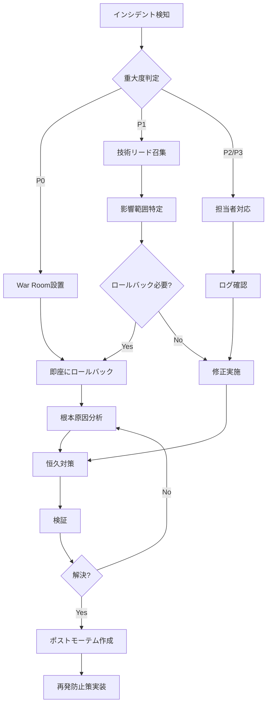

# Runbook: context-optimization

> 運用手順書。インシデント対応、デプロイ、ロールバック、日常運用の手順を定義。

## 1. 緊急連絡先

### 1.1 役割と責任

| 役割 | 責任範囲 | 対応時間 | 連絡方法 |
|------|---------|---------|---------|
| **インシデント責任者** | 全体統括、意思決定 | 24/7 | Slack DM, 電話 |
| **技術リード** | 技術判断、実装 | 平日9-18時 | Slack #tech |
| **SREエンジニア** | 監視、復旧、ポストモーテム | 24/7 | PagerDuty |
| **セキュリティ担当** | セキュリティインシデント対応 | 24/7 | Slack #security |

### 1.2 エスカレーションパス

```
Level 1: 担当エンジニア（初動対応、15分以内）
  ↓ 解決しない場合
Level 2: 技術リード（技術判断、30分以内）
  ↓ 解決しない場合
Level 3: インシデント責任者（全体統括、即座）
  ↓ 重大インシデントの場合
Level 4: 全チーム招集、War Room設置
```

---

## 2. インシデント対応

### 2.1 重大度定義

| レベル | 定義 | 影響範囲 | 対応時間 | 例 |
|--------|------|---------|---------|-----|
| **P0 - Critical** | システム全停止、データ損失 | 全ユーザー | 即座 | セッション起動不可、設定ファイル破損 |
| **P1 - High** | 主要機能停止 | 多数のユーザー | 1時間以内 | Hook実行失敗、MCP起動不可 |
| **P2 - Medium** | 一部機能停止、パフォーマンス低下 | 一部ユーザー | 4時間以内 | スキルロード遅延、メトリクス記録失敗 |
| **P3 - Low** | 軽微な問題、警告 | 限定的 | 24時間以内 | ダッシュボード表示バグ |

### 2.2 インシデント対応フロー



---

## 3. P0インシデント対応手順

### 3.1 P0-001: セッション起動失敗

**症状**:
- Claude Codeが起動しない
- "Failed to load configuration" エラー
- セッション開始時にクラッシュ

**初動対応（5分以内）**:

```bash
# 1. 設定ファイルの検証
cat ~/.claude.json | jq .
cat .claude/settings.json | jq .

# エラーが出る場合、JSON構文エラー
# → 直前のバックアップから復元

# 2. バックアップから復元
cp ~/.claude.json.backup ~/.claude.json
cp .claude/settings.json.backup .claude/settings.json

# 3. セッション再起動
claude
```

**根本原因調査**:

```bash
# 設定変更履歴の確認
git log --oneline --all -- .claude/settings.json

# 監査ログの確認
tail -100 .claude/hooks/data/audit.log | grep settings.json

# 最終変更者の特定
git log -1 --format="%an <%ae>" .claude/settings.json
```

**恒久対策**:
- Config Validator Hook（M-T-001-2）の強化
- pre-commit hookでJSON検証を必須化

---

### 3.2 P0-002: データ損失・設定ファイル破損

**症状**:
- スキル定義が消失
- 設定ファイルが破損
- メトリクスデータが消失

**初動対応（10分以内）**:

```bash
# 1. システム停止
pkill -f claude

# 2. 破損範囲の特定
ls -la .claude/skills/*/skill.json
ls -la .claude/settings.json
ls -la .claude/hooks/data/*.jsonl

# 3. バックアップから完全復元
cd .kiro/specs/context-optimization/backup/
tar xzf backup-$(date +%Y%m%d).tar.gz -C /

# 4. 復元確認
cat .claude/settings.json | jq .
ls -la .claude/skills/ | wc -l  # スキル数確認

# 5. セッション再起動
claude
```

**根本原因調査**:

```bash
# ディスク状態確認
df -h
dmesg | grep -i error

# ファイルシステムエラー確認
sudo fsck /dev/sda1  # Linux
diskutil verifyVolume /  # macOS

# 最終アクセス時刻確認
stat .claude/settings.json
```

**恒久対策**:
- 1時間ごとの自動バックアップ（cron設定）
- 設定ファイルの読み取り専用化（M-T-001-1）

---

### 3.3 P0-003: Criticalエラー多発

**症状**:
- Alert-E-001（Criticalエラー）が連続発生
- セッションが頻繁にクラッシュ
- データ整合性エラー

**初動対応（5分以内）**:

```bash
# 1. エラーログ確認
tail -100 .claude/hooks/data/metrics.jsonl | grep '"severity":"Critical"'

# 2. 最新の変更を特定
git log --oneline --all --since="1 hour ago"

# 3. 即座にロールバック
bash scripts/rollback.sh

# 4. セッション再起動
claude
```

**詳細調査**:

```bash
# エラーパターン分析
cat .claude/hooks/data/metrics.jsonl | \
  jq -r 'select(.severity=="Critical") | .message' | \
  sort | uniq -c | sort -rn

# スタックトレース確認
cat .claude/hooks/data/metrics.jsonl | \
  jq -r 'select(.severity=="Critical") | .stack'

# 発生頻度のグラフ化
cat .claude/hooks/data/metrics.jsonl | \
  jq -r 'select(.severity=="Critical") | .timestamp' | \
  cut -c1-13 | uniq -c
```

**恒久対策**:
- Canary Release制御（M-D-001-1）の強化
- 自動ロールバック閾値の見直し

---

## 4. P1インシデント対応手順

### 4.1 P1-001: Hook実行失敗率上昇

**症状**:
- Alert-A-002（Hook失敗率上昇）発火
- Hook実行時にエラー多発
- セッションが不安定

**対応手順**:

```bash
# 1. 失敗しているHookを特定
cat .claude/hooks/data/metrics.jsonl | \
  jq -r 'select(.type=="hook_execution" and .success==false) | .hook' | \
  sort | uniq -c | sort -rn

# 例出力:
#   15 .claude/hooks/PreToolUse.js
#    3 .claude/hooks/PostToolUse.js

# 2. 失敗Hookを一時無効化
mv .claude/hooks/PreToolUse.js .claude/hooks/PreToolUse.js.disabled

# 3. セッション再起動して確認
claude

# 4. Hook実行ログを詳細確認
tail -50 .claude/hooks/data/hook_execution.log
```

**根本原因調査**:

```bash
# エラーメッセージ集計
cat .claude/hooks/data/metrics.jsonl | \
  jq -r 'select(.type=="hook_execution" and .success==false) | .error' | \
  sort | uniq -c

# Hook実行時間の分析
cat .claude/hooks/data/metrics.jsonl | \
  jq -r 'select(.type=="hook_latency") | [.hook, .duration_ms] | @tsv' | \
  awk '{sum[$1]+=$2; count[$1]++} END {for (h in sum) print h, sum[h]/count[h]}' | \
  sort -k2 -rn
```

**恒久対策**:
- Hook実行タイムアウトの追加（M-D-001-1）
- Hookのリトライ機構実装

---

### 4.2 P1-002: トークン消費急増

**症状**:
- Alert-S-001（トークン消費超過）発火
- 初期トークン消費が40,000超過
- セッション時間が大幅短縮

**対応手順**:

```bash
# 1. 現在のトークン消費を確認
cat .claude/hooks/data/metrics.jsonl | \
  tail -1 | jq '.token_consumption_initial'

# 2. 有効化されているMCPを確認
cat ~/.claude.json | jq '.mcpServers | keys'

# 3. 不要なMCPを無効化
cat ~/.claude.json | jq '.mcpServers | del(.["unnecessary-mcp-1"], .["unnecessary-mcp-2"])' > ~/.claude.json.tmp
mv ~/.claude.json.tmp ~/.claude.json

# 4. スキル数を確認
ls .claude/skills/ | wc -l

# 5. disable-model-invocation設定を確認
grep -r "disable-model-invocation" .claude/skills/*/skill.json | wc -l

# 6. セッション再起動
claude
```

**詳細調査**:

```bash
# トークン消費推移の分析
cat .claude/hooks/data/metrics.jsonl | \
  jq -r '[.timestamp, .token_consumption_initial] | @tsv' | \
  tail -100

# MCPごとのトークン消費を推定
# （MCP無効化前後で比較）
```

**恒久対策**:
- MCP同時起動数制限（M-D-003-1）の厳格化
- 自動MCP最適化スクリプトの実装

---

### 4.3 P1-003: MCP起動失敗

**症状**:
- 特定MCPサーバーが起動しない
- "MCP connection failed" エラー
- 機能の一部が使用不可

**対応手順**:

```bash
# 1. MCPプロセス状態確認
ps aux | grep mcp

# 2. MCP起動ログ確認
tail -100 ~/.claude/mcp.log

# 3. 失敗しているMCPを特定
cat ~/.claude.json | jq '.mcpServers | keys'

# 4. 個別にMCP起動テスト
npx -y @modelcontextprotocol/server-filesystem /tmp

# エラーが出る場合、MCPサーバー自体の問題
# → 一時的に無効化

# 5. 設定から除外
cat ~/.claude.json | jq '.mcpServers | del(.["failing-mcp"])' > ~/.claude.json.tmp
mv ~/.claude.json.tmp ~/.claude.json

# 6. セッション再起動
claude
```

**根本原因調査**:

```bash
# MCPバージョン確認
npm list -g | grep @modelcontextprotocol

# 依存関係エラー確認
cd ~/.claude/mcp-servers/failing-mcp/
npm install

# ポート競合確認
lsof -i :PORT_NUMBER
```

**恒久対策**:
- MCP Health Check（定期監視）の実装
- MCP自動再起動機構の追加

---

## 5. デプロイ手順

### 5.1 通常デプロイ（Canary Release）

**前提条件**:
- 全テストがパス
- コードレビュー完了
- バックアップ作成済み

**手順**:

```bash
# Phase 0: 準備
# 1. バックアップ作成
bash scripts/backup.sh

# 2. 現在の状態を記録
git rev-parse HEAD > .deploy/previous_commit.txt
cat .claude/settings.json > .deploy/previous_settings.json

# Phase 1: 10% Canary
# 3. Canary設定を有効化
cat > .claude/canary.json <<EOF
{
  "enabled": true,
  "percentage": 10,
  "duration_minutes": 60,
  "metrics_threshold": {
    "error_rate": 0.01,
    "latency_p95": 500
  }
}
EOF

# 4. 変更をデプロイ
git checkout feature/new-optimization
cp -r .claude/skills/new-skill/ ~/.claude/skills/

# 5. セッション再起動
claude

# 6. 60分間監視
bash scripts/monitor_canary.sh

# Phase 2: 50% Rollout（品質OK の場合）
# 7. Canary比率を上げる
jq '.percentage = 50' .claude/canary.json > .claude/canary.json.tmp
mv .claude/canary.json.tmp .claude/canary.json

# 8. さらに60分監視
bash scripts/monitor_canary.sh

# Phase 3: 100% Rollout（品質OK の場合）
# 9. 完全デプロイ
jq '.percentage = 100' .claude/canary.json > .claude/canary.json.tmp
mv .claude/canary.json.tmp .claude/canary.json

# 10. Canary無効化
jq '.enabled = false' .claude/canary.json > .claude/canary.json.tmp
mv .claude/canary.json.tmp .claude/canary.json

# 11. デプロイ完了を記録
echo "Deployed $(git rev-parse HEAD) at $(date)" >> .deploy/history.log
```

**品質チェック（各Phase後）**:

```bash
# エラー率確認
cat .claude/hooks/data/metrics.jsonl | \
  tail -100 | \
  jq -r 'select(.type=="error") | 1' | \
  wc -l

# レイテンシ確認
cat .claude/hooks/data/metrics.jsonl | \
  jq -r 'select(.type=="hook_latency") | .duration_ms' | \
  sort -n | \
  awk '{a[NR]=$1} END {print a[int(NR*0.95)]}'  # P95

# トークン消費確認
cat .claude/hooks/data/metrics.jsonl | \
  tail -1 | \
  jq '.token_consumption_initial'
```

**自動ロールバック条件**:
- エラー率 > 1%
- Hook実行時間P95 > 500ms
- トークン消費 > 40,000

---

### 5.2 緊急デプロイ（Hotfix）

**使用ケース**:
- P0/P1インシデントの緊急修正
- Criticalセキュリティパッチ

**手順**:

```bash
# 1. Hotfixブランチ作成
git checkout -b hotfix/critical-fix main

# 2. 修正実装
vim .claude/hooks/PreToolUse.js

# 3. 最小限のテスト
bash tests/critical_path_test.sh

# 4. バックアップ作成
bash scripts/backup.sh

# 5. 即座にデプロイ（Canaryスキップ）
git add .
git commit -m "hotfix: Fix critical Hook execution bug"
cp .claude/hooks/PreToolUse.js ~/.claude/hooks/

# 6. セッション再起動
claude

# 7. 5分間の集中監視
watch -n 10 'tail -20 .claude/hooks/data/metrics.jsonl'

# 8. 問題なければmainにマージ
git checkout main
git merge hotfix/critical-fix
git push origin main
```

**Hotfix後の必須作業**:
- ポストモーテム作成（24時間以内）
- 根本原因分析
- 再発防止策の実装

---

## 6. ロールバック手順

### 6.1 自動ロールバック

**トリガー**:
- Error Budget枯渇（0%）
- Criticalエラー連続発生（5分間に3回以上）
- トークン消費が50,000超過

**自動実行スクリプト**:

```bash
# scripts/auto_rollback.sh
#!/bin/bash
set -euo pipefail

echo "[$(date)] Auto-rollback triggered" >> .deploy/rollback.log

# 1. 前回のコミットを取得
PREVIOUS_COMMIT=$(cat .deploy/previous_commit.txt)

# 2. Git rollback
git checkout $PREVIOUS_COMMIT

# 3. 設定ファイル復元
cp .deploy/previous_settings.json .claude/settings.json

# 4. スキルファイル復元
tar xzf .deploy/previous_skills.tar.gz -C .claude/skills/

# 5. Hookファイル復元
tar xzf .deploy/previous_hooks.tar.gz -C .claude/hooks/

# 6. セッション再起動
pkill -f claude
sleep 2
claude &

# 7. 通知
curl -X POST $SLACK_WEBHOOK_URL -d '{
  "text": "🚨 Auto-rollback executed to '$PREVIOUS_COMMIT'"
}'

echo "[$(date)] Auto-rollback completed" >> .deploy/rollback.log
```

---

### 6.2 手動ロールバック

**使用ケース**:
- Canary Release中に品質低下を検知
- デプロイ後に予期しない問題発生

**手順**:

```bash
# 1. 現在の状態を確認
git log --oneline -10
cat .deploy/history.log | tail -5

# 2. ロールバック先を決定
ROLLBACK_COMMIT="abc1234"  # 直前の安定版

# 3. バックアップ作成（念のため）
bash scripts/backup.sh

# 4. ロールバック実行
bash scripts/rollback.sh $ROLLBACK_COMMIT

# 5. セッション再起動
claude

# 6. 品質確認（10分間監視）
bash scripts/monitor.sh

# 7. ロールバック記録
echo "Rolled back to $ROLLBACK_COMMIT at $(date)" >> .deploy/rollback.log
```

**ロールバック後の確認項目**:

```bash
# トークン消費の確認
cat .claude/hooks/data/metrics.jsonl | tail -1 | jq '.token_consumption_initial'
# → 40,000以下であることを確認

# エラー率の確認
cat .claude/hooks/data/metrics.jsonl | \
  tail -100 | \
  jq -r 'select(.type=="error") | 1' | wc -l
# → 1件以下であることを確認

# Hook実行時間の確認
cat .claude/hooks/data/metrics.jsonl | \
  jq -r 'select(.type=="hook_latency") | .duration_ms' | \
  awk '{sum+=$1; n++} END {print sum/n}'
# → 100ms以下であることを確認
```

---

## 7. 日常運用タスク

### 7.1 日次タスク

| タスク | 内容 | 所要時間 | 担当 |
|--------|------|---------|------|
| メトリクス確認 | ダッシュボードでSLO達成状況確認 | 5分 | SRE |
| アラート確認 | 過去24時間のアラート履歴確認 | 5分 | SRE |
| Error Budget確認 | 残りBudgetが50%以上であることを確認 | 3分 | SRE |

**実行コマンド**:

```bash
# 日次チェックスクリプト
bash scripts/daily_check.sh

# 出力例:
# ✅ SLO達成率: 18/19 (94.7%)
# ✅ Error Budget: 全て50%以上
# ⚠️  Alert: 2件（Medium）
```

---

### 7.2 週次タスク

| タスク | 内容 | 所要時間 | 担当 |
|--------|------|---------|------|
| SLOレポート作成 | 週次SLO達成状況レポート生成 | 15分 | SRE |
| バックアップ検証 | バックアップからの復元テスト | 30分 | SRE |
| セキュリティスキャン | Trivy等での脆弱性スキャン | 10分 | Security |

**実行コマンド**:

```bash
# 週次レポート生成
python scripts/generate_weekly_report.py > reports/weekly_$(date +%Y%m%d).md

# バックアップ復元テスト
bash scripts/test_backup_restore.sh

# セキュリティスキャン
trivy fs .claude/
```

---

### 7.3 月次タスク

| タスク | 内容 | 所要時間 | 担当 |
|--------|------|---------|------|
| SLO見直し | 目標値の適切性を評価 | 1時間 | PO, SRE |
| 古いメトリクス削除 | 30日以上前のメトリクス圧縮 | 10分 | SRE |
| ポストモーテム集計 | 月次インシデント集計 | 30分 | SRE |

---

## 8. 緊急コマンド参照

### 8.1 クイックリファレンス

```bash
# 即座にロールバック
bash scripts/rollback.sh

# バックアップから復元
bash scripts/restore_from_backup.sh

# 全MCPを無効化（緊急時）
echo '{"mcpServers":{}}' > ~/.claude.json

# 特定Hookを無効化
mv .claude/hooks/HookName.js .claude/hooks/HookName.js.disabled

# トークン消費を確認
cat .claude/hooks/data/metrics.jsonl | tail -1 | jq '.token_consumption_initial'

# エラーログを確認
tail -100 .claude/hooks/data/metrics.jsonl | jq 'select(.type=="error")'

# セッション強制終了
pkill -9 -f claude
```

### 8.2 診断コマンド

```bash
# システム全体の健全性チェック
bash scripts/health_check.sh

# 出力例:
# ✅ Config files: OK
# ✅ Hooks: OK (5/5)
# ✅ Skills: OK (192/192)
# ✅ MCP: OK (8/8)
# ✅ Metrics: OK (collecting)
# ❌ Disk space: CRITICAL (95% used)

# 詳細診断
bash scripts/deep_diagnostics.sh > diagnostics_$(date +%Y%m%d_%H%M%S).log
```

---

## 9. ポストモーテム

### 9.1 ポストモーテムテンプレート

```markdown
# Postmortem: [インシデント概要]

**日時**: YYYY-MM-DD HH:MM - HH:MM
**重大度**: P0/P1/P2
**影響範囲**: [ユーザー数、機能]
**検知方法**: [アラート/ユーザー報告/監視]

## タイムライン

| 時刻 | イベント |
|------|---------|
| HH:MM | インシデント発生 |
| HH:MM | アラート発火（Alert-XXX） |
| HH:MM | 担当者が初動対応開始 |
| HH:MM | ロールバック実施 |
| HH:MM | 復旧完了 |

## 根本原因

[詳細な根本原因分析。5 Whysを使用]

## 影響

- 影響を受けたユーザー数: XX人
- ダウンタイム: XX分
- Error Budget消費: XX%

## 対応内容

### 即座の対応
- [実施した緊急対応]

### 恒久対策
- [ ] [再発防止策1] - 担当: XX, 期限: YYYY-MM-DD
- [ ] [再発防止策2] - 担当: XX, 期限: YYYY-MM-DD

## 学んだこと

### うまくいったこと
- [良かった点]

### 改善すべきこと
- [改善点]

## アクションアイテム

| ID | アクション | 担当 | 期限 | ステータス |
|----|-----------|------|------|-----------|
| AI-001 | XXXの実装 | XX | YYYY-MM-DD | Open |
```

### 9.2 ポストモーテム作成ルール

- **必須作成条件**: P0/P1インシデント
- **作成期限**: インシデント解決後24時間以内
- **レビュー**: チーム全員でレビュー
- **保管場所**: `.kiro/specs/context-optimization/postmortems/`

---

## 10. 付録

### 10.1 重要ファイル一覧

| ファイルパス | 用途 | バックアップ頻度 |
|------------|------|-----------------|
| `~/.claude.json` | グローバル設定、MCP定義 | 毎時 |
| `.claude/settings.json` | プロジェクト設定 | 毎時 |
| `.claude/skills/*/skill.json` | スキル定義 | 日次 |
| `.claude/hooks/*.js` | Hookスクリプト | 日次 |
| `.claude/hooks/data/metrics.jsonl` | メトリクスデータ | 週次 |
| `.kiro/specs/*/backup/` | バックアップアーカイブ | - |

### 10.2 ログファイル一覧

| ログファイル | 内容 | 保持期間 |
|------------|------|---------|
| `.claude/hooks/data/metrics.jsonl` | 全メトリクス | 30日 |
| `.claude/hooks/data/audit.log` | 設定変更監査 | 90日 |
| `.claude/hooks/data/hook_execution.log` | Hook実行ログ | 7日 |
| `.deploy/history.log` | デプロイ履歴 | 無期限 |
| `.deploy/rollback.log` | ロールバック履歴 | 無期限 |

---

**生成日時**: 2026-02-15
**バージョン**: 1.0.0
**次のステップ**: 運用開始、インシデント対応訓練の実施
