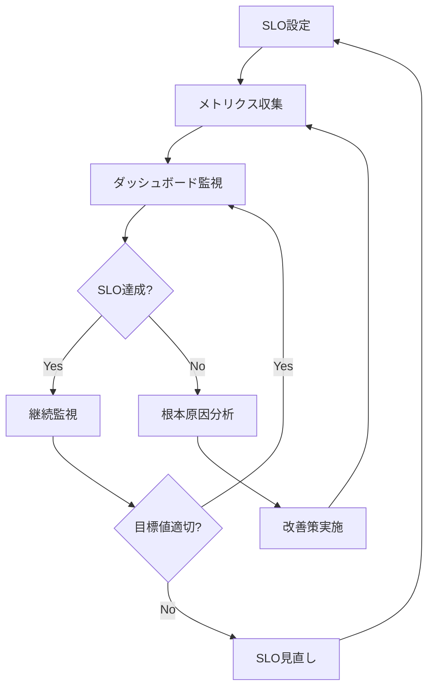

# SLO/SLI: context-optimization

> Google SREに基づくサービスレベル目標・指標定義。システムの信頼性を測定可能な形で定義。

## 1. SLI/SLO概要

### 1.1 SREの4つの黄金シグナル

| シグナル | 定義 | Context Optimizationでの適用 |
|---------|------|----------------------------|
| **Latency** | リクエスト処理時間 | Hook実行時間、スキルロード時間 |
| **Traffic** | システム負荷 | セッション数、ツール呼び出し数 |
| **Errors** | エラー率 | Hook失敗率、設定検証エラー率 |
| **Saturation** | リソース使用率 | トークン消費率、メモリ使用率 |

### 1.2 サービスレベル定義

| レベル | 可用性 | 月次ダウンタイム | 用途 |
|--------|--------|-----------------|------|
| 99.9% (3-nine) | 99.9% | 43分 | 本システムの目標 |
| 99.99% (4-nine) | 99.99% | 4分 | クリティカルシステム |
| 99.999% (5-nine) | 99.999% | 26秒 | ミッションクリティカル |

**本システムの目標**: 99.9%（月次43分以内のダウンタイム）

---

## 2. SLI定義

### 2.1 可用性（Availability）

#### SLI-A-001: セッション成功率

**定義**:
```
セッション成功率 = (成功セッション数 / 総セッション数) × 100
```

**成功条件**:
- セッション開始に成功
- 致命的エラーなし
- 正常終了

**測定方法**:
```javascript
// SessionStart.js
const sessionStart = Date.now();

// SessionStop.js
const sessionEnd = Date.now();
const success = (criticalErrors === 0);

recordMetric({
  type: 'availability',
  session_id: sessionId,
  success: success,
  duration: sessionEnd - sessionStart
});
```

**Prometheusクエリ**:
```promql
# セッション成功率（過去1時間）
sum(rate(session_success_total[1h])) / sum(rate(session_total[1h]))
```

---

#### SLI-A-002: Hook実行成功率

**定義**:
```
Hook成功率 = (成功Hook実行数 / 総Hook実行数) × 100
```

**成功条件**:
- Hook実行完了
- exit code 0
- タイムアウトなし

**測定方法**:
```javascript
// hook_executor.js
function executeHook(hookPath) {
  const start = Date.now();
  try {
    const result = require(hookPath)();
    recordMetric({
      type: 'hook_execution',
      hook: hookPath,
      success: true,
      duration: Date.now() - start
    });
    return result;
  } catch (error) {
    recordMetric({
      type: 'hook_execution',
      hook: hookPath,
      success: false,
      error: error.message
    });
    throw error;
  }
}
```

**Prometheusクエリ**:
```promql
# Hook成功率（過去24時間）
sum(rate(hook_success_total[24h])) / sum(rate(hook_total[24h]))
```

---

### 2.2 レイテンシ（Latency）

#### SLI-L-001: Hook実行時間

**定義**:
```
Hook実行時間 = Hook開始時刻 - Hook終了時刻
```

**パーセンタイル目標**:
- P50（中央値）: ≤100ms
- P95（95パーセンタイル）: ≤500ms
- P99（99パーセンタイル）: ≤1000ms

**測定方法**:
```javascript
// hook_executor.js
const start = performance.now();
const result = executeHook(hookPath);
const duration = performance.now() - start;

recordMetric({
  type: 'hook_latency',
  hook: hookPath,
  duration_ms: duration
});
```

**Prometheusクエリ**:
```promql
# Hook実行時間のP95（過去1時間）
histogram_quantile(0.95, rate(hook_duration_ms_bucket[1h]))

# Hook実行時間のP99（過去1時間）
histogram_quantile(0.99, rate(hook_duration_ms_bucket[1h]))
```

---

#### SLI-L-002: スキルロード時間

**定義**:
```
スキルロード時間 = スキル読み込み開始 - スキル読み込み完了
```

**パーセンタイル目標**:
- P50: ≤50ms
- P95: ≤200ms
- P99: ≤500ms

**測定方法**:
```javascript
// skill_warehouse.js
function loadSkill(skillPath) {
  const start = performance.now();
  const skill = require(skillPath);
  const duration = performance.now() - start;

  recordMetric({
    type: 'skill_load_latency',
    skill: skillPath,
    duration_ms: duration
  });

  return skill;
}
```

**Prometheusクエリ**:
```promql
# スキルロード時間のP95
histogram_quantile(0.95, rate(skill_load_duration_ms_bucket[1h]))
```

---

#### SLI-L-003: 設定ファイル読み込み時間

**定義**:
```
設定読み込み時間 = 読み込み開始 - 読み込み完了
```

**目標**:
- P95: ≤100ms
- P99: ≤200ms

**測定方法**:
```javascript
// config_loader.js
function loadConfig(configPath) {
  const start = performance.now();
  const config = JSON.parse(fs.readFileSync(configPath));
  const duration = performance.now() - start;

  recordMetric({
    type: 'config_load_latency',
    config: configPath,
    duration_ms: duration
  });

  return config;
}
```

---

### 2.3 エラー率（Error Rate）

#### SLI-E-001: セッションエラー率

**定義**:
```
エラー率 = (エラーセッション数 / 総セッション数) × 100
```

**目標**: <1%

**エラー分類**:
| エラータイプ | 重大度 | 例 |
|------------|--------|-----|
| Critical | 致命的 | システムクラッシュ、データ損失 |
| High | 高 | Hook失敗、スキルロード失敗 |
| Medium | 中 | 設定検証警告 |
| Low | 低 | メトリクス記録失敗 |

**測定方法**:
```javascript
// error_tracker.js
function trackError(error, severity) {
  recordMetric({
    type: 'error',
    severity: severity,
    message: error.message,
    stack: error.stack
  });

  if (severity === 'Critical') {
    sendAlert('Critical error occurred', error);
  }
}
```

**Prometheusクエリ**:
```promql
# エラー率（過去1時間）
sum(rate(session_error_total[1h])) / sum(rate(session_total[1h]))

# Critical エラー数（過去24時間）
sum(increase(error_total{severity="Critical"}[24h]))
```

---

#### SLI-E-002: Hook実行エラー率

**定義**:
```
Hook エラー率 = (失敗Hook実行数 / 総Hook実行数) × 100
```

**目標**: <0.5%

**測定方法**:
```javascript
// hook_executor.js
try {
  executeHook(hookPath);
  incrementCounter('hook_success_total');
} catch (error) {
  incrementCounter('hook_error_total');
  trackError(error, 'High');
}
```

---

### 2.4 飽和度（Saturation）

#### SLI-S-001: トークン消費率

**定義**:
```
トークン消費率 = (実際のトークン消費 / 目標トークン上限) × 100
```

**目標**: ≤100%（40,000 tokens以下）

**測定方法**:
```javascript
// SessionStart.js
const initialTokens = getInitialContextTokens();

recordMetric({
  type: 'token_consumption',
  initial_tokens: initialTokens,
  target: 40000,
  usage_ratio: (initialTokens / 40000) * 100
});
```

**Prometheusクエリ**:
```promql
# トークン消費率（過去1時間の平均）
avg_over_time(token_consumption_ratio[1h])

# トークン消費のP95
histogram_quantile(0.95, rate(token_consumption_bucket[1h]))
```

---

#### SLI-S-002: メモリ使用率

**定義**:
```
メモリ使用率 = (使用メモリ / 利用可能メモリ) × 100
```

**目標**: <80%

**測定方法**:
```javascript
// resource_monitor.js
setInterval(() => {
  const usage = process.memoryUsage();
  const total = os.totalmem();

  recordMetric({
    type: 'memory_usage',
    used_mb: usage.heapUsed / 1024 / 1024,
    total_mb: total / 1024 / 1024,
    usage_ratio: (usage.heapUsed / total) * 100
  });
}, 60000); // 1分ごと
```

---

#### SLI-S-003: セッション時間

**定義**:
```
セッション時間 = セッション終了時刻 - セッション開始時刻
```

**目標**: ≥120分（中央値）

**測定方法**:
```javascript
// SessionStop.js
const sessionDuration = (Date.now() - sessionStartTime) / 1000 / 60;

recordMetric({
  type: 'session_duration',
  duration_minutes: sessionDuration,
  target: 120
});
```

**Prometheusクエリ**:
```promql
# セッション時間の中央値（過去24時間）
histogram_quantile(0.5, rate(session_duration_minutes_bucket[24h]))
```

---

## 3. SLO定義

### 3.1 可用性SLO

| SLO ID | 指標 | 目標値 | 測定期間 | Error Budget |
|--------|------|--------|---------|-------------|
| SLO-A-001 | セッション成功率 | ≥99.0% | 30日 | 1.0% |
| SLO-A-002 | Hook実行成功率 | ≥99.5% | 30日 | 0.5% |
| SLO-A-003 | スキルロード成功率 | ≥99.9% | 30日 | 0.1% |
| SLO-A-004 | MCP起動成功率 | ≥99.0% | 30日 | 1.0% |

**Error Budget計算例（SLO-A-001）**:
```
目標: 99.0%
Error Budget: 1.0%

30日間の総セッション数: 1000
許容エラー数: 1000 × 0.01 = 10セッション

現在のエラー数: 5セッション
残りError Budget: (10 - 5) / 10 = 50%
```

---

### 3.2 レイテンシSLO

| SLO ID | 指標 | 目標値 | パーセンタイル | 測定期間 |
|--------|------|--------|--------------|---------|
| SLO-L-001 | Hook実行時間 | ≤100ms | P50 | 7日 |
| SLO-L-002 | Hook実行時間 | ≤500ms | P95 | 7日 |
| SLO-L-003 | Hook実行時間 | ≤1000ms | P99 | 7日 |
| SLO-L-004 | スキルロード時間 | ≤50ms | P50 | 7日 |
| SLO-L-005 | スキルロード時間 | ≤200ms | P95 | 7日 |
| SLO-L-006 | 設定読み込み時間 | ≤100ms | P95 | 7日 |

---

### 3.3 エラー率SLO

| SLO ID | 指標 | 目標値 | 測定期間 | Error Budget |
|--------|------|--------|---------|-------------|
| SLO-E-001 | セッションエラー率 | <1.0% | 30日 | 1.0% |
| SLO-E-002 | Hook実行エラー率 | <0.5% | 30日 | 0.5% |
| SLO-E-003 | Criticalエラー数 | 0件 | 30日 | 0件 |
| SLO-E-004 | 設定検証エラー率 | <2.0% | 30日 | 2.0% |

---

### 3.4 飽和度SLO

| SLO ID | 指標 | 目標値 | 測定期間 |
|--------|------|--------|---------|
| SLO-S-001 | 初期トークン消費 | ≤40,000 tokens | 即時 |
| SLO-S-002 | トークン削減率 | ≥55% | 即時 |
| SLO-S-003 | セッション時間（中央値） | ≥120分 | 7日 |
| SLO-S-004 | メモリ使用率 | <80% | 即時 |
| SLO-S-005 | ディスク使用率 | <90% | 即時 |

---

## 4. Error Budget管理

### 4.1 Error Budgetポリシー

**基本方針**:
- Error Budgetが50%以下になったら警告
- Error Budgetが20%以下になったら新機能開発停止
- Error Budgetが0%になったらロールバック実施

### 4.2 Error Budget計算

```javascript
// error_budget_calculator.js
function calculateErrorBudget(sloId, windowDays = 30) {
  const slo = getSLO(sloId);
  const totalRequests = getTotalRequests(windowDays);
  const errorRequests = getErrorRequests(windowDays);

  const actualErrorRate = (errorRequests / totalRequests) * 100;
  const allowedErrorRate = 100 - slo.target;
  const budgetUsed = (actualErrorRate / allowedErrorRate) * 100;
  const budgetRemaining = 100 - budgetUsed;

  return {
    slo_id: sloId,
    total_requests: totalRequests,
    error_requests: errorRequests,
    actual_error_rate: actualErrorRate,
    allowed_error_rate: allowedErrorRate,
    budget_used_percent: budgetUsed,
    budget_remaining_percent: budgetRemaining,
    status: getBudgetStatus(budgetRemaining)
  };
}

function getBudgetStatus(remaining) {
  if (remaining > 50) return 'HEALTHY';
  if (remaining > 20) return 'WARNING';
  if (remaining > 0) return 'CRITICAL';
  return 'EXHAUSTED';
}
```

### 4.3 Error Budget消費時のアクション

| 残りBudget | ステータス | アクション |
|-----------|-----------|----------|
| >50% | HEALTHY | 通常運用 |
| 20-50% | WARNING | アラート送信、根本原因分析開始 |
| 0-20% | CRITICAL | 新機能開発停止、修正に集中 |
| 0% | EXHAUSTED | 即座にロールバック、ポストモーテム |

---

## 5. アラートルール

### 5.1 可用性アラート

#### Alert-A-001: セッション失敗率上昇

**条件**:
```promql
# 過去1時間のセッション失敗率が1%超過
(sum(rate(session_error_total[1h])) / sum(rate(session_total[1h]))) > 0.01
```

**重大度**: High
**通知先**: Slack #alerts
**対応**: 直近の変更をロールバック、ログ確認

---

#### Alert-A-002: Hook実行失敗率上昇

**条件**:
```promql
# 過去30分のHook失敗率が0.5%超過
(sum(rate(hook_error_total[30m])) / sum(rate(hook_total[30m]))) > 0.005
```

**重大度**: High
**通知先**: Slack #alerts
**対応**: 失敗したHookを特定、一時無効化

---

### 5.2 レイテンシアラート

#### Alert-L-001: Hook実行遅延

**条件**:
```promql
# 過去15分のHook実行時間P95が500ms超過
histogram_quantile(0.95, rate(hook_duration_ms_bucket[15m])) > 500
```

**重大度**: Medium
**通知先**: Slack #performance
**対応**: Hook処理の最適化検討

---

#### Alert-L-002: スキルロード遅延

**条件**:
```promql
# 過去15分のスキルロード時間P95が200ms超過
histogram_quantile(0.95, rate(skill_load_duration_ms_bucket[15m])) > 200
```

**重大度**: Medium
**通知先**: Slack #performance
**対応**: スキルキャッシュの確認

---

### 5.3 エラー率アラート

#### Alert-E-001: Criticalエラー発生

**条件**:
```promql
# 過去5分にCriticalエラーが1件以上発生
increase(error_total{severity="Critical"}[5m]) > 0
```

**重大度**: Critical
**通知先**: Slack #critical, PagerDuty
**対応**: 即座にロールバック、インシデント対応開始

---

### 5.4 飽和度アラート

#### Alert-S-001: トークン消費超過

**条件**:
```promql
# 初期トークン消費が40,000超過
token_consumption_initial > 40000
```

**重大度**: High
**通知先**: Slack #alerts
**対応**: 設定確認、不要なMCP/スキル無効化

---

#### Alert-S-002: メモリ使用率上昇

**条件**:
```promql
# メモリ使用率が80%超過
memory_usage_ratio > 80
```

**重大度**: Medium
**通知先**: Slack #performance
**対応**: メモリリーク確認、プロセス再起動

---

#### Alert-S-003: セッション時間短縮

**条件**:
```promql
# 過去24時間のセッション時間中央値が120分未満
histogram_quantile(0.5, rate(session_duration_minutes_bucket[24h])) < 120
```

**重大度**: High
**通知先**: Slack #alerts
**対応**: トークン消費の増加原因を調査

---

## 6. ダッシュボード定義

### 6.1 メインダッシュボード

**パネル構成**:

```
┌─────────────────────────────────────────────────────────────┐
│ Context Optimization - Main Dashboard                       │
├─────────────────────────────────────────────────────────────┤
│                                                             │
│  ┌──────────────┐  ┌──────────────┐  ┌──────────────┐     │
│  │ セッション    │  │ トークン      │  │ エラー率      │     │
│  │ 成功率        │  │ 消費量        │  │              │     │
│  │              │  │              │  │              │     │
│  │   99.2%      │  │  35,234      │  │   0.8%       │     │
│  └──────────────┘  └──────────────┘  └──────────────┘     │
│                                                             │
│  ┌──────────────────────────────────────────────────────┐  │
│  │ セッション時間推移（過去7日）                         │  │
│  │                                                      │  │
│  │  [グラフ: 時系列でセッション時間の中央値を表示]       │  │
│  │                                                      │  │
│  └──────────────────────────────────────────────────────┘  │
│                                                             │
│  ┌──────────────────────────────────────────────────────┐  │
│  │ トークン消費推移（過去30日）                          │  │
│  │                                                      │  │
│  │  [グラフ: 初期トークン消費の推移、目標線40K]          │  │
│  │                                                      │  │
│  └──────────────────────────────────────────────────────┘  │
│                                                             │
│  ┌───────────────────┐  ┌───────────────────────────────┐  │
│  │ Hook実行時間       │  │ Error Budget残量              │  │
│  │                   │  │                               │  │
│  │ P50: 85ms         │  │ SLO-A-001: 65%               │  │
│  │ P95: 420ms        │  │ SLO-E-001: 72%               │  │
│  │ P99: 890ms        │  │ SLO-S-001: HEALTHY           │  │
│  └───────────────────┘  └───────────────────────────────┘  │
│                                                             │
└─────────────────────────────────────────────────────────────┘
```

### 6.2 Grafanaパネル定義

#### パネル1: セッション成功率（ゲージ）

```json
{
  "title": "Session Success Rate",
  "type": "gauge",
  "targets": [
    {
      "expr": "sum(rate(session_success_total[30d])) / sum(rate(session_total[30d]))",
      "legendFormat": "Success Rate"
    }
  ],
  "fieldConfig": {
    "defaults": {
      "thresholds": {
        "mode": "absolute",
        "steps": [
          { "value": 0, "color": "red" },
          { "value": 0.99, "color": "yellow" },
          { "value": 0.995, "color": "green" }
        ]
      },
      "unit": "percentunit"
    }
  }
}
```

#### パネル2: トークン消費推移（時系列グラフ）

```json
{
  "title": "Token Consumption Over Time",
  "type": "timeseries",
  "targets": [
    {
      "expr": "avg_over_time(token_consumption_initial[1h])",
      "legendFormat": "Actual"
    },
    {
      "expr": "vector(40000)",
      "legendFormat": "Target (40K)"
    }
  ],
  "fieldConfig": {
    "defaults": {
      "unit": "short",
      "custom": {
        "lineWidth": 2
      }
    }
  }
}
```

#### パネル3: Error Budget残量（バー）

```json
{
  "title": "Error Budget Remaining",
  "type": "bargauge",
  "targets": [
    {
      "expr": "error_budget_remaining_percent{slo_id='SLO-A-001'}",
      "legendFormat": "Session Availability"
    },
    {
      "expr": "error_budget_remaining_percent{slo_id='SLO-E-001'}",
      "legendFormat": "Error Rate"
    }
  ],
  "fieldConfig": {
    "defaults": {
      "thresholds": {
        "mode": "absolute",
        "steps": [
          { "value": 0, "color": "red" },
          { "value": 20, "color": "orange" },
          { "value": 50, "color": "yellow" },
          { "value": 80, "color": "green" }
        ]
      },
      "unit": "percent"
    }
  }
}
```

---

## 7. SLO達成状況レポート

### 7.1 週次レポート形式

```markdown
# Context Optimization - Weekly SLO Report

**期間**: YYYY-MM-DD ～ YYYY-MM-DD
**生成日時**: YYYY-MM-DD HH:MM:SS

## 概要

| カテゴリ | 達成SLO数 | 未達成SLO数 | 達成率 |
|---------|----------|------------|--------|
| 可用性   | 4 / 4    | 0          | 100%   |
| レイテンシ | 5 / 6    | 1          | 83.3%  |
| エラー率 | 4 / 4    | 0          | 100%   |
| 飽和度   | 5 / 5    | 0          | 100%   |
| **合計** | **18 / 19** | **1** | **94.7%** |

## SLO達成詳細

### 可用性

- ✅ SLO-A-001: セッション成功率 99.2% (目標: 99.0%)
- ✅ SLO-A-002: Hook実行成功率 99.7% (目標: 99.5%)
- ✅ SLO-A-003: スキルロード成功率 99.95% (目標: 99.9%)
- ✅ SLO-A-004: MCP起動成功率 99.1% (目標: 99.0%)

### レイテンシ

- ✅ SLO-L-001: Hook実行時間 P50 85ms (目標: ≤100ms)
- ✅ SLO-L-002: Hook実行時間 P95 420ms (目標: ≤500ms)
- ❌ SLO-L-003: Hook実行時間 P99 1050ms (目標: ≤1000ms) **未達成**
- ✅ SLO-L-004: スキルロード P50 45ms (目標: ≤50ms)
- ✅ SLO-L-005: スキルロード P95 180ms (目標: ≤200ms)
- ✅ SLO-L-006: 設定読み込み P95 85ms (目標: ≤100ms)

### エラー率

- ✅ SLO-E-001: セッションエラー率 0.8% (目標: <1.0%)
- ✅ SLO-E-002: Hook実行エラー率 0.3% (目標: <0.5%)
- ✅ SLO-E-003: Criticalエラー数 0件 (目標: 0件)
- ✅ SLO-E-004: 設定検証エラー率 1.5% (目標: <2.0%)

### 飽和度

- ✅ SLO-S-001: 初期トークン消費 35,234 (目標: ≤40,000)
- ✅ SLO-S-002: トークン削減率 62% (目標: ≥55%)
- ✅ SLO-S-003: セッション時間中央値 145分 (目標: ≥120分)
- ✅ SLO-S-004: メモリ使用率 72% (目標: <80%)
- ✅ SLO-S-005: ディスク使用率 65% (目標: <90%)

## Error Budget状況

| SLO ID | 残りBudget | ステータス | アクション |
|--------|-----------|-----------|----------|
| SLO-A-001 | 65% | HEALTHY | なし |
| SLO-E-001 | 72% | HEALTHY | なし |
| SLO-L-003 | 15% | CRITICAL | Hook最適化が必要 |

## アラート履歴

| 日時 | アラート | 重大度 | 対応 |
|------|---------|--------|------|
| 2026-02-12 14:23 | Hook実行遅延 (Alert-L-001) | Medium | Hook処理を最適化 |
| 2026-02-13 09:45 | トークン消費超過 (Alert-S-001) | High | MCP 3個を無効化 |

## 改善アクション

1. **SLO-L-003未達成**: Hook実行時間P99が目標超過
   - 原因: 特定Hookの処理時間が長い
   - 対策: 非同期化、タイムアウト設定の見直し
   - 期限: 2026-02-20

2. **Error Budget低下（SLO-L-003）**: 残り15%
   - 対策: 新機能開発を一時停止、修正に集中
   - 期限: 2026-02-18

## 総評

今週は全体的に良好な結果でした。18/19のSLOを達成し、達成率94.7%を記録しました。
ただし、Hook実行時間のP99が目標を超過しており、Error Budgetが15%まで低下しているため、
早急な改善が必要です。
```

---

## 8. 継続的改善

### 8.1 SLOレビュープロセス

| 頻度 | レビュー内容 | 参加者 |
|------|------------|--------|
| 週次 | SLO達成状況確認 | チーム全員 |
| 月次 | SLO目標値の見直し | プロダクトオーナー、SRE |
| 四半期 | 新SLOの追加/削除 | 全ステークホルダー |

### 8.2 SLO改善サイクル



---

**生成日時**: 2026-02-15
**バージョン**: 1.0.0
**次のステップ**: メトリクス収集実装、ダッシュボード構築
