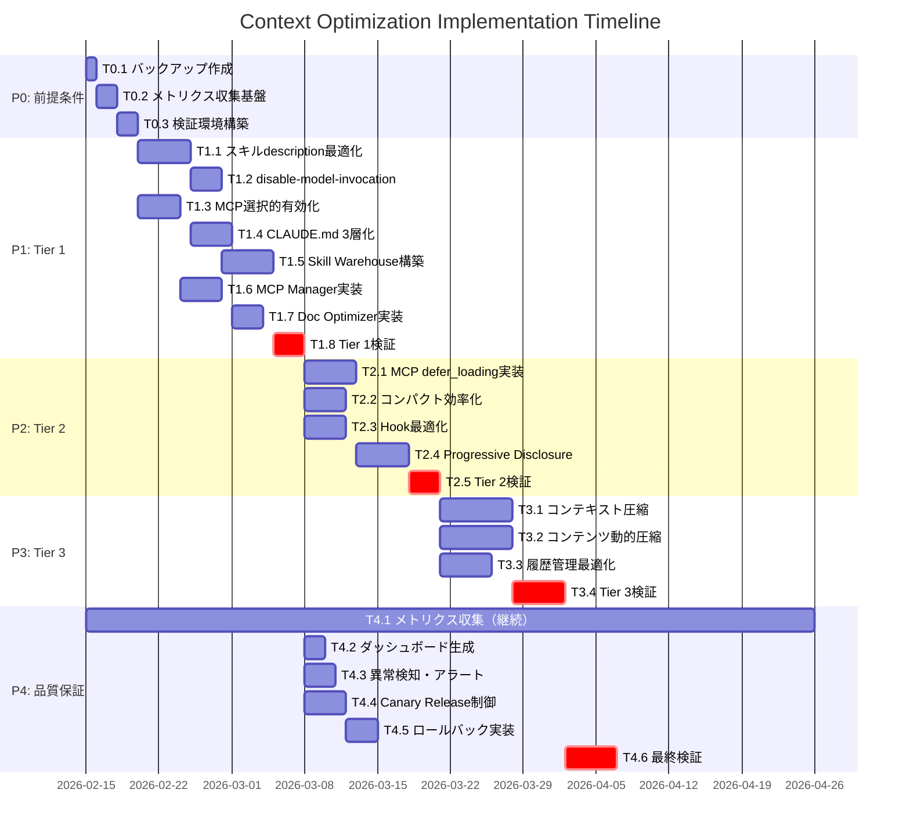
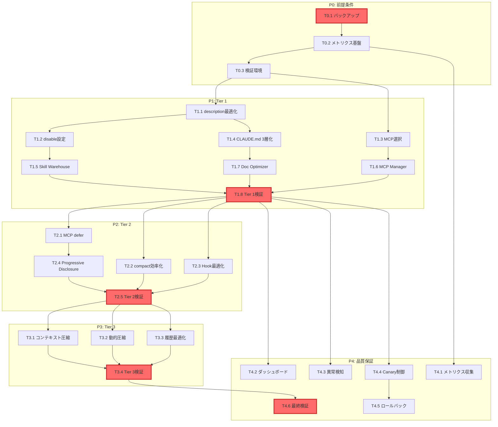

# Tasks: context-optimization

> Kiro形式のタスク分解。design.mdの設計を実装可能な作業単位に分割。

## 1. タスク一覧

### 1.1 全体構成

| Phase | フェーズ名 | タスク数 | 期間 | 依存関係 |
|-------|-----------|---------|------|---------|
| P0 | 前提条件整備 | 3 | Week 0 | - |
| P1 | Tier 1: 即時削減 | 8 | Week 1-3 | P0 |
| P2 | Tier 2: 中期改善 | 5 | Week 4-6 | P1 |
| P3 | Tier 3: 長期最適化 | 4 | Week 7-10 | P2 |
| P4 | 品質保証 | 6 | 全期間 | P1, P2, P3 |

**総タスク数**: 26
**総期間**: 10週間
**並行実行可能**: P4は全期間並行

### 1.2 ガントチャート



## 2. Phase 0: 前提条件整備

### T0.1: 設定バックアップ作成

**概要**: 現在の設定ファイルを全てバックアップ

**詳細**:
- `.claude/` 配下の全設定ファイル
- `.claude/skills/` 配下の全スキル
- `~/.claude.json` グローバル設定
- Git管理外のファイルも含む

**成果物**:
- `.kiro/specs/context-optimization/backup/` ディレクトリ
- backup.tar.gz（タイムスタンプ付き）

**受け入れ基準**:
- [ ] 全設定ファイルがバックアップされている
- [ ] 復元手順書が作成されている
- [ ] バックアップの完全性が検証されている

**見積もり**: 0.5人日
**優先度**: P0（最高）
**リスク**: なし

---

### T0.2: メトリクス収集基盤整備

**概要**: SessionStart/Stop hookでメトリクス収集開始

**詳細**:
- `.claude/hooks/SessionStart.js` にメトリクス収集追加
- `.claude/hooks/data/metrics.jsonl` に記録
- 収集項目: 初期トークン数、セッション時間、ツール呼び出し数

**成果物**:
- SessionStart.js（拡張版）
- metrics.jsonl（収集開始）
- metrics_schema.json（スキーマ定義）

**受け入れ基準**:
- [ ] 全セッションでメトリクス収集が自動実行される
- [ ] JSONL形式で正しく記録される
- [ ] スキーマに準拠したデータが記録される

**見積もり**: 1人日
**優先度**: P0
**リスク**: なし

---

### T0.3: 検証環境構築

**概要**: 安全にテストできる環境を用意

**詳細**:
- `.claude/settings.test.json` 作成（テスト用設定）
- テスト用MCP無効化リスト
- テスト用スキル無効化リスト

**成果物**:
- settings.test.json
- test-environment.md（手順書）

**受け入れ基準**:
- [ ] 本番環境に影響を与えずテストできる
- [ ] 切り替えが1コマンドで可能
- [ ] テスト結果が記録される

**見積もり**: 1人日
**優先度**: P0
**リスク**: なし

---

## 3. Phase 1: Tier 1（即時削減: 17-30K tokens）

### T1.1: スキルdescription英語化・短縮

**概要**: 全スキルのdescriptionを最適化（REQ-001）

**詳細**:
- 192個のスキルdescriptionを英語化
- 平均50文字以下に短縮
- 日本語説明はSKILL.md本文に移動

**成果物**:
- 192個の`.claude/skills/*/skill.json`（更新）
- description_optimization_report.md

**受け入れ基準**:
- [ ] 全スキルdescriptionが英語化
- [ ] 平均50文字以下を達成
- [ ] 機能性を損なわない
- [ ] 削減トークン数: 8-12K

**見積もり**: 3人日
**優先度**: P0
**リスク**: 低（機能影響なし）

**依存関係**: なし

---

### T1.2: disable-model-invocation設定

**概要**: 呼び出し時のみ内容をロード（REQ-002）

**詳細**:
- skill.json に `disable-model-invocation: true` 追加
- 対象: 使用頻度が低いスキル（30個程度）
- 除外: 高頻度スキル（taiyo-style, research等）

**成果物**:
- 30個のskill.json（更新）
- disable_list.md（適用一覧）

**受け入れ基準**:
- [ ] 低頻度スキルにdisable設定追加
- [ ] 高頻度スキルは除外
- [ ] 機能性を損なわない
- [ ] 削減トークン数: 5-8K

**見積もり**: 2人日
**優先度**: P0
**リスク**: 低（選定ミスのリスク）

**依存関係**: T1.1完了後

---

### T1.3: MCP選択的有効化

**概要**: プロジェクト別にMCPを選択（REQ-003）

**詳細**:
- `.claude/settings.json` に `disabledMcpServers` 設定
- プロジェクト特性別に推奨セット作成
- 最大10個のMCPに制限

**成果物**:
- settings.json（テンプレート3種）
  - development.json（開発用）
  - marketing.json（マーケ用）
  - research.json（リサーチ用）
- mcp_selection_guide.md

**受け入れ基準**:
- [ ] 3種類のプリセット作成
- [ ] 各プリセットでMCP数≤10
- [ ] 削減トークン数: 3-5K

**見積もり**: 2人日
**優先度**: P0
**リスク**: 低（プリセット選定ミス）

**依存関係**: なし（並行可能）

---

### T1.4: CLAUDE.md 3層化

**概要**: ドキュメントを3層に分離（REQ-011）

**詳細**:
- L1: CLAUDE.md（基本、500行以下）
- L2: .claude/docs/advanced.md（詳細）
- L3: .claude/docs/expert.md（上級）

**成果物**:
- CLAUDE.md（縮小版）
- advanced.md（新規）
- expert.md（新規）
- progressive_disclosure.md（ガイド）

**受け入れ基準**:
- [ ] CLAUDE.md が500行以下
- [ ] 基本機能の説明は維持
- [ ] 詳細はリンク参照可能
- [ ] 削減トークン数: 1-5K

**見積もり**: 2人日
**優先度**: P1
**リスク**: 中（情報設計ミス）

**依存関係**: T1.1完了後

---

### T1.5: Skill Warehouse システム構築

**概要**: スキル遅延ロード機構実装

**詳細**:
- `.claude/hooks/PreToolUse.js` 拡張
- skill.json に `warehouse: true` フラグ
- 初回呼び出しで内容ロード
- キャッシュ機構（セッション内）

**成果物**:
- PreToolUse.js（拡張版）
- skill_warehouse.js（ライブラリ）
- warehouse_config.json

**受け入れ基準**:
- [ ] 遅延ロードが正常動作
- [ ] キャッシュが機能
- [ ] パフォーマンス低下なし
- [ ] 削減トークン数: 0K（初期）、セッション延長効果

**見積もり**: 3人日
**優先度**: P1
**リスク**: 中（実装複雑度）

**依存関係**: T1.2完了後

---

### T1.6: MCP Manager 実装

**概要**: MCP選択的有効化の自動制御

**詳細**:
- プロジェクトタイプ検出（git, package.json等）
- 推奨MCPセット自動適用
- settings.json 自動生成

**成果物**:
- mcp_manager.js
- project_detector.js
- auto_config.sh（CLI）

**受け入れ基準**:
- [ ] プロジェクトタイプ検出が正確
- [ ] 推奨MCPセットが適切
- [ ] 1コマンドで設定適用可能

**見積もり**: 2人日
**優先度**: P1
**リスク**: 低（検出ロジック）

**依存関係**: T1.3完了後

---

### T1.7: Doc Optimizer 実装

**概要**: CLAUDE.md 3層化の自動生成

**詳細**:
- 既存CLAUDE.mdを解析
- セクション重要度判定
- 3層への自動分割

**成果物**:
- doc_optimizer.py
- importance_rules.yaml
- split_claude.sh

**受け入れ基準**:
- [ ] 自動分割が適切
- [ ] リンク参照が正しい
- [ ] 500行以下を達成

**見積もり**: 2人日
**優先度**: P2
**リスク**: 中（分割ロジック）

**依存関係**: T1.4完了後

---

### T1.8: Tier 1 検証

**概要**: Tier 1施策の効果測定

**詳細**:
- 10セッションで測定
- トークン削減率、セッション時間、エラー率
- 目標: 17-30K削減、30分→120分延長

**成果物**:
- tier1_validation_report.md
- metrics_tier1.jsonl

**受け入れ基準**:
- [ ] トークン削減: 17-30K達成
- [ ] セッション時間: 120分以上
- [ ] エラー率: <1%

**見積もり**: 2人日
**優先度**: P0（ゲート）
**リスク**: 低（測定のみ）

**依存関係**: T1.5, T1.6, T1.7完了後

---

## 4. Phase 2: Tier 2（中期改善: +3K tokens）

### T2.1: MCP defer_loading 実装

**概要**: MCP起動を遅延（REQ-007）

**詳細**:
- ~/.claude.json に defer_loading 設定追加
- 初回使用時に起動
- 不使用MCPは起動しない

**成果物**:
- .claude.json（拡張版）
- mcp_defer_loader.js

**受け入れ基準**:
- [ ] defer_loading が機能
- [ ] 初回使用時に正常起動
- [ ] 削減トークン数: 1-2K

**見積もり**: 3人日
**優先度**: P1
**リスク**: 中（MCP互換性）

**依存関係**: T1.8完了後

---

### T2.2: コンパクト効率化

**概要**: /compact の実行効率向上（REQ-012）

**詳細**:
- セッション30分で自動compact提案
- 重要情報の保持ロジック改善
- compact後の復元精度向上

**成果物**:
- compact_optimizer.js
- auto_compact_hook.js

**受け入れ基準**:
- [ ] 30分で自動提案
- [ ] 復元精度: 95%以上
- [ ] セッション延長: +30分

**見積もり**: 2人日
**優先度**: P1
**リスク**: 低（既存機能改善）

**依存関係**: T1.8完了後

---

### T2.3: Hook 最適化

**概要**: Hook実行の軽量化（REQ-013）

**詳細**:
- 不要なHook無効化
- Hook実行時間計測
- 非同期化可能なHookを特定

**成果物**:
- hook_profiler.js
- optimized_hooks/（最適化版）

**受け入れ基準**:
- [ ] Hook実行時間: <100ms
- [ ] 非同期化で応答性向上
- [ ] 削減トークン数: 0.5-1K

**見積もり**: 2人日
**優先度**: P2
**リスク**: 低（パフォーマンス改善）

**依存関係**: T1.8完了後

---

### T2.4: Progressive Disclosure 実装

**概要**: 段階的情報開示機構

**詳細**:
- L1→L2→L3の自動ナビゲーション
- コマンド `/help-advanced`, `/help-expert` 追加
- 必要に応じて詳細ロード

**成果物**:
- help_navigator.js
- progressive_disclosure.md

**受け入れ基準**:
- [ ] コマンドが機能
- [ ] L1で基本操作可能
- [ ] L2, L3への誘導が適切

**見積もり**: 3人日
**優先度**: P2
**リスク**: 低（UX改善）

**依存関係**: T2.1完了後

---

### T2.5: Tier 2 検証

**概要**: Tier 2施策の効果測定

**詳細**:
- 10セッションで測定
- 追加削減、セッション延長

**成果物**:
- tier2_validation_report.md
- metrics_tier2.jsonl

**受け入れ基準**:
- [ ] 追加削減: 3K達成
- [ ] セッション時間: 150分以上
- [ ] エラー率: <1%

**見積もり**: 2人日
**優先度**: P0（ゲート）
**リスク**: 低（測定のみ）

**依存関係**: T2.2, T2.3, T2.4完了後

---

## 5. Phase 3: Tier 3（長期最適化: +5-10K tokens）

### T3.1: コンテキスト圧縮

**概要**: 高度なコンテキスト圧縮技術導入（REQ-014）

**詳細**:
- セマンティック圧縮（重要度判定）
- 冗長情報の自動除去
- 圧縮後の復元精度保証

**成果物**:
- context_compressor.py
- semantic_analyzer.js

**受け入れ基準**:
- [ ] 圧縮率: 20-30%
- [ ] 復元精度: 90%以上
- [ ] 削減トークン数: 3-5K

**見積もり**: 4人日
**優先度**: P2
**リスク**: 高（圧縮精度）

**依存関係**: T2.5完了後

---

### T3.2: コンテンツ動的圧縮

**概要**: コンテンツ参照時に動的圧縮（REQ-015）

**詳細**:
- スキル/MCP内容の動的要約
- 使用頻度に応じた詳細度調整
- キャッシュ機構

**成果物**:
- dynamic_compressor.js
- usage_tracker.js

**受け入れ基準**:
- [ ] 動的圧縮が機能
- [ ] 使用頻度トラッキング正確
- [ ] 削減トークン数: 2-3K

**見積もり**: 4人日
**優先度**: P2
**リスク**: 高（実装複雑度）

**依存関係**: T2.5完了後

---

### T3.3: 履歴管理最適化

**概要**: 会話履歴の効率的管理（REQ-016）

**詳細**:
- 古い履歴の自動要約
- 重要履歴の優先保持
- 参照頻度に基づく圧縮

**成果物**:
- history_optimizer.js
- importance_scorer.js

**受け入れ基準**:
- [ ] 古い履歴が自動要約
- [ ] 重要履歴は保持
- [ ] 削減トークン数: 0-2K（セッション長に依存）

**見積もり**: 3人日
**優先度**: P3
**リスク**: 中（要約精度）

**依存関係**: T2.5完了後

---

### T3.4: Tier 3 検証

**概要**: Tier 3施策の効果測定

**詳細**:
- 10セッションで測定
- 最終目標達成確認

**成果物**:
- tier3_validation_report.md
- metrics_tier3.jsonl

**受け入れ基準**:
- [ ] 追加削減: 5-10K達成
- [ ] 総削減: 25-43K達成
- [ ] セッション時間: 180分以上
- [ ] エラー率: <1%

**見積もり**: 3人日
**優先度**: P0（ゲート）
**リスク**: 低（測定のみ）

**依存関係**: T3.1, T3.2, T3.3完了後

---

## 6. Phase 4: 品質保証（全期間並行）

### T4.1: メトリクス収集（継続）

**概要**: 全期間でメトリクス収集継続（REQ-904）

**詳細**:
- SessionStart/Stopで自動収集
- JSONL形式で記録
- 日次集計

**成果物**:
- metrics.jsonl（継続更新）
- daily_summary/（日次レポート）

**受け入れ基準**:
- [ ] 全セッションで収集
- [ ] データ欠損なし
- [ ] スキーマ準拠

**見積もり**: 0.5人日/週
**優先度**: P0
**リスク**: なし

**依存関係**: T0.2完了後

---

### T4.2: ダッシュボード生成

**概要**: 週次ダッシュボード自動生成（REQ-905）

**詳細**:
- metrics.jsonl からグラフ生成
- トークン削減率、セッション時間推移
- Markdown + 画像形式

**成果物**:
- dashboard_generator.py
- weekly_dashboard.md（自動更新）

**受け入れ基準**:
- [ ] 週次で自動生成
- [ ] グラフが正確
- [ ] 読みやすい

**見積もり**: 1人日
**優先度**: P1
**リスク**: 低（可視化）

**依存関係**: T1.8完了後

---

### T4.3: 異常検知・アラート

**概要**: メトリクス異常を自動検知（REQ-906）

**詳細**:
- トークン消費急増検知
- エラー率上昇検知
- Slack/Discord通知

**成果物**:
- anomaly_detector.js
- alert_config.json

**受け入れ基準**:
- [ ] 異常検知が正確
- [ ] 通知が即座
- [ ] 誤検知率: <5%

**見積もり**: 2人日
**優先度**: P1
**リスク**: 中（閾値設定）

**依存関係**: T1.8完了後

---

### T4.4: Canary Release 制御

**概要**: 段階的リリース機構（REQ-907）

**詳細**:
- 10%→50%→100% の自動制御
- 品質メトリクス監視
- 自動停止（品質低下時）

**成果物**:
- canary_controller.js
- release_config.json

**受け入れ基準**:
- [ ] 段階的リリースが機能
- [ ] 品質監視が正確
- [ ] 自動停止が機能

**見積もり**: 2人日
**優先度**: P1
**リスク**: 中（制御ロジック）

**依存関係**: T1.8完了後

---

### T4.5: ロールバック実装

**概要**: 自動ロールバック機構（REQ-908）

**詳細**:
- 品質低下検知でロールバック
- バックアップから復元
- 1コマンドで手動ロールバック

**成果物**:
- rollback_manager.sh
- restore.sh

**受け入れ基準**:
- [ ] 自動ロールバックが機能
- [ ] 復元が完全
- [ ] 手動実行も可能

**見積もり**: 2人日
**優先度**: P0
**リスク**: 低（復元のみ）

**依存関係**: T4.4完了後

---

### T4.6: 最終検証

**概要**: 全施策の総合検証（REQ-900-903）

**詳細**:
- 30セッションで最終測定
- 全受け入れ基準の確認
- 本番環境での検証

**成果物**:
- final_validation_report.md
- production_metrics.jsonl
- release_approval.md

**受け入れ基準**:
- [ ] REQ-900: トークン消費≤40K
- [ ] REQ-901: セッション時間≥120分
- [ ] REQ-902: 削減率≥55%
- [ ] REQ-903: エラー率<1%

**見積もり**: 3人日
**優先度**: P0（最終ゲート）
**リスク**: 低（検証のみ）

**依存関係**: T3.4完了後

---

## 7. 依存関係グラフ



## 8. リスク管理

### 8.1 高リスクタスク

| タスク | リスク内容 | 影響度 | 確率 | 軽減策 |
|--------|-----------|--------|------|--------|
| T3.1 | 圧縮精度低下 | 高 | 中 | 段階的実装、復元テスト強化 |
| T3.2 | 動的圧縮の複雑度 | 高 | 中 | プロトタイプ検証、段階的展開 |
| T2.1 | MCP互換性問題 | 中 | 中 | 互換性テスト、ロールバック準備 |
| T1.5 | Warehouse実装複雑度 | 中 | 低 | 既存Hook参考、テスト強化 |

### 8.2 リスク対応計画

**T3.1 圧縮精度低下**:
- 軽減策: プロトタイプで精度検証（目標90%）
- 回避策: 圧縮率を下げる（20%→15%）
- 受容: 精度85%以上なら許容

**T3.2 動的圧縮の複雑度**:
- 軽減策: 段階的実装（Phase 1: 基本、Phase 2: 高度）
- 回避策: 静的圧縮のみ実装
- 転嫁: 外部ライブラリ使用検討

**T2.1 MCP互換性問題**:
- 軽減策: 全MCPでdefer_loading動作確認
- 回避策: 互換性のないMCPは除外
- 受容: 95%互換で許容

## 9. リソース計画

### 9.1 工数サマリー

| Phase | タスク数 | 総工数 | 期間 |
|-------|---------|--------|------|
| P0 | 3 | 2.5人日 | 5日 |
| P1 | 8 | 19人日 | 21日 |
| P2 | 5 | 12人日 | 21日 |
| P3 | 4 | 14人日 | 35日 |
| P4 | 6 | 11.5人日 | 全期間 |
| **合計** | **26** | **59人日** | **70日** |

### 9.2 クリティカルパス

```
T0.1 → T0.2 → T0.3 → T1.1 → T1.2 → T1.5 → T1.8 → T2.1 → T2.4 → T2.5 → T3.1 → T3.4 → T4.6
```

**クリティカルパス総期間**: 70日
**余裕時間（バッファ）**: 0日（並行作業で吸収）

### 9.3 並行実行可能タスク

**Week 1-3**:
- T1.1, T1.3（並行可能）
- T1.2, T1.4（順次）
- T1.5, T1.6, T1.7（順次後、並行可能）

**Week 4-6**:
- T2.1, T2.2, T2.3（並行可能）
- T2.4（T2.1完了後）

**Week 7-10**:
- T3.1, T3.2, T3.3（並行可能）

**全期間**:
- T4.1（常時実行）
- T4.2, T4.3, T4.4（P1完了後並行）

## 10. 完了基準

### 10.1 各Phaseの完了定義

| Phase | 完了基準 |
|-------|---------|
| P0 | 全バックアップ作成、メトリクス収集開始、検証環境準備完了 |
| P1 | トークン17-30K削減、セッション120分以上、エラー率<1% |
| P2 | 追加3K削減、セッション150分以上、エラー率<1% |
| P3 | 追加5-10K削減、セッション180分以上、エラー率<1% |
| P4 | 全受け入れ基準達成、本番リリース承認 |

### 10.2 プロジェクト全体の完了基準

- [ ] REQ-900: 初期トークン消費≤40K
- [ ] REQ-901: セッション継続時間≥120分
- [ ] REQ-902: トークン削減率≥55%
- [ ] REQ-903: エラー率<1%
- [ ] REQ-904: メトリクス収集100%
- [ ] REQ-905: ダッシュボード自動生成
- [ ] REQ-906: 異常検知・アラート機能
- [ ] REQ-907: Canary Release制御
- [ ] REQ-908: 自動ロールバック機能

---

**生成日時**: 2026-02-15
**バージョン**: 1.0.0
**次のステップ**: Phase 0 開始（T0.1: バックアップ作成）
