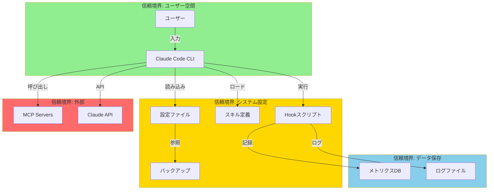
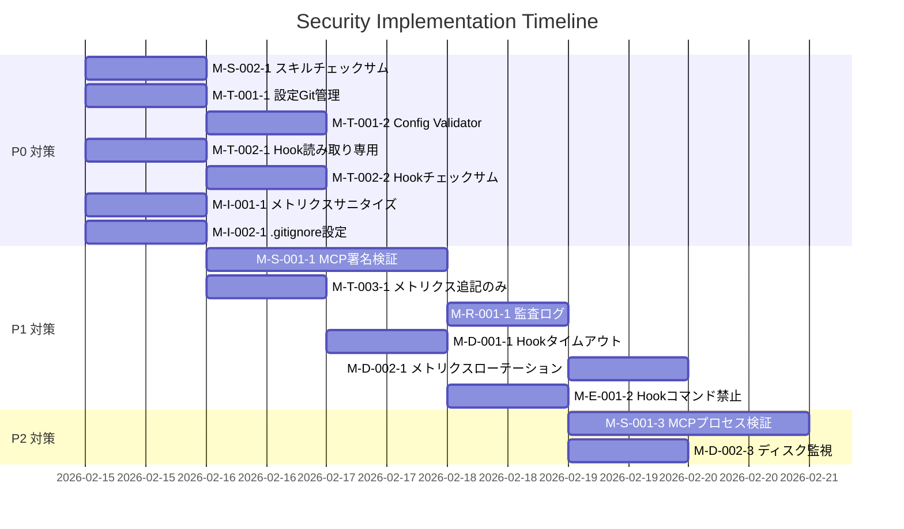
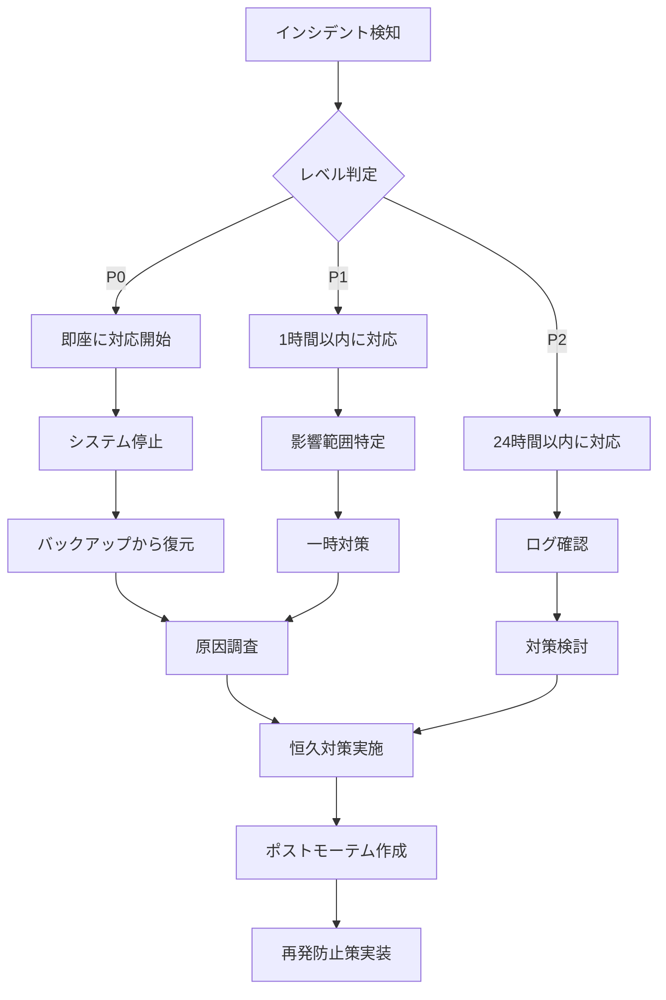

# Threat Model: context-optimization

> STRIDE脅威モデルに基づくセキュリティ分析。システムの脅威を特定し、対策を定義。

## 1. システム概要

### 1.1 対象システム
- **システム名**: Claude Code Context Optimization System
- **境界**: Claude Code CLI、設定ファイル、Hook、MCP、スキル
- **データフロー**: ユーザー入力 → Claude Code → Hook → 設定読み込み → ツール実行 → メトリクス記録

### 1.2 資産分類

| 資産カテゴリ | 資産名 | 機密性 | 完全性 | 可用性 | 重要度 |
|------------|--------|--------|--------|--------|--------|
| **設定ファイル** | .claude/settings.json | 高 | 高 | 中 | Critical |
| **設定ファイル** | ~/.claude.json | 高 | 高 | 中 | Critical |
| **スキル定義** | .claude/skills/*/skill.json | 中 | 高 | 高 | High |
| **メトリクスデータ** | .claude/hooks/data/metrics.jsonl | 低 | 中 | 中 | Medium |
| **Hookスクリプト** | .claude/hooks/*.js | 中 | 高 | 高 | High |
| **バックアップ** | .kiro/specs/*/backup/ | 高 | 高 | 高 | Critical |
| **MCP設定** | .claude.json (mcpServers) | 高 | 高 | 中 | Critical |
| **ユーザーデータ** | セッション履歴、会話内容 | 高 | 高 | 中 | Critical |

### 1.3 信頼境界



**境界定義**:
- **緑（ユーザー空間）**: 最も信頼できる領域
- **黄（システム設定）**: 管理者権限で保護すべき領域
- **赤（外部）**: 信頼できない外部システム
- **青（データ保存）**: 監査・復旧が必要な領域

---

## 2. STRIDE 脅威分析

### 2.1 Spoofing（なりすまし）

#### T-S-001: MCP Server なりすまし

**脅威内容**:
悪意のあるMCPサーバーが正規MCPになりすまし、Claude Codeに接続。

**影響**:
- ユーザーデータの窃取
- 不正なツール実行
- セッション情報の漏洩

**影響度**: High
**発生確率**: Medium

**対策**:

| 対策ID | 対策内容 | 実装場所 | 優先度 |
|--------|---------|---------|--------|
| M-S-001-1 | MCP署名検証機構の実装 | ~/.claude.json | P1 |
| M-S-001-2 | 許可リスト方式（明示的なMCP指定） | .claude/settings.json | P0 |
| M-S-001-3 | MCPプロセスID検証 | mcp_manager.js | P2 |

**実装例**:
```json
// ~/.claude.json
{
  "mcpServers": {
    "filesystem": {
      "command": "npx",
      "args": ["-y", "@modelcontextprotocol/server-filesystem"],
      "signature": "sha256:abc123...",  // 追加
      "allowedHosts": ["localhost"]      // 追加
    }
  }
}
```

---

#### T-S-002: スキルファイル改ざん後のなりすまし

**脅威内容**:
攻撃者がスキルファイル（skill.json）を改ざんし、悪意のあるスキルとして実行。

**影響**:
- 任意コード実行
- データ窃取
- システム破壊

**影響度**: Critical
**発生確率**: Low

**対策**:

| 対策ID | 対策内容 | 実装場所 | 優先度 |
|--------|---------|---------|--------|
| M-S-002-1 | スキルファイルのチェックサム検証 | skill_warehouse.js | P0 |
| M-S-002-2 | 読み取り専用スキルディレクトリ | filesystem permissions | P1 |
| M-S-002-3 | スキルロード時の署名検証 | PreToolUse.js | P1 |

**実装例**:
```javascript
// skill_warehouse.js
function loadSkill(skillPath) {
  const checksum = calculateChecksum(skillPath);
  const expected = loadChecksumDB()[skillPath];

  if (checksum !== expected) {
    throw new Error(`Skill integrity check failed: ${skillPath}`);
  }

  return require(skillPath);
}
```

---

### 2.2 Tampering（改ざん）

#### T-T-001: 設定ファイル改ざん

**脅威内容**:
攻撃者が .claude/settings.json や ~/.claude.json を改ざんし、不正な設定を注入。

**影響**:
- disabledMcpServers 無効化
- 危険なMCPの有効化
- セキュリティ設定の無効化

**影響度**: Critical
**発生確率**: Medium

**対策**:

| 対策ID | 対策内容 | 実装場所 | 優先度 |
|--------|---------|---------|--------|
| M-T-001-1 | 設定ファイルのバージョン管理（Git） | .git/ | P0 |
| M-T-001-2 | Config Validator Hook（PreToolUse） | .claude/hooks/PreToolUse.js | P0 |
| M-T-001-3 | 設定変更時の承認フロー | config_validator.js | P1 |
| M-T-001-4 | 設定ファイルのバックアップ自動作成 | auto_backup.sh | P1 |

**実装例**:
```javascript
// PreToolUse.js (Config Validator)
function validateConfig(configPath) {
  const config = JSON.parse(fs.readFileSync(configPath));
  const schema = loadSchema();

  if (!schema.validate(config)) {
    throw new Error(`Invalid config: ${schema.errors}`);
  }

  // 危険な設定の検出
  if (config.mcpServers && Object.keys(config.mcpServers).length > 15) {
    console.warn('WARNING: Too many MCP servers enabled (>15)');
  }

  return config;
}
```

---

#### T-T-002: Hookスクリプト改ざん

**脅威内容**:
攻撃者が .claude/hooks/*.js を改ざんし、悪意のあるコードを実行。

**影響**:
- 任意コード実行
- メトリクス改ざん
- セキュリティ機構の無効化

**影響度**: Critical
**発生確率**: Low

**対策**:

| 対策ID | 対策内容 | 実装場所 | 優先度 |
|--------|---------|---------|--------|
| M-T-002-1 | Hookファイルの読み取り専用化 | filesystem permissions | P0 |
| M-T-002-2 | Hook実行前のチェックサム検証 | hook_loader.js | P0 |
| M-T-002-3 | Hookの署名検証 | SessionStart.js | P1 |
| M-T-002-4 | Hook変更の監査ログ | audit.log | P2 |

**実装例**:
```bash
# Hookファイルの保護
chmod 444 .claude/hooks/*.js
chattr +i .claude/hooks/*.js  # Linux/Mac: immutable flag
```

---

#### T-T-003: メトリクスデータ改ざん

**脅威内容**:
攻撃者が metrics.jsonl を改ざんし、品質低下を隠蔽。

**影響**:
- Canary Release判定の誤作動
- ロールバック判定の無効化
- 異常検知の失敗

**影響度**: High
**発生確率**: Low

**対策**:

| 対策ID | 対策内容 | 実装場所 | 優先度 |
|--------|---------|---------|--------|
| M-T-003-1 | メトリクスの追記のみ許可（書き換え禁止） | metrics_collector.js | P1 |
| M-T-003-2 | メトリクスのタイムスタンプ検証 | anomaly_detector.js | P1 |
| M-T-003-3 | メトリクスの署名付き記録 | metrics_signer.js | P2 |

**実装例**:
```javascript
// metrics_collector.js
function recordMetric(metric) {
  const signed = {
    ...metric,
    timestamp: Date.now(),
    signature: hmac(metric, SECRET_KEY)
  };

  fs.appendFileSync('metrics.jsonl', JSON.stringify(signed) + '\n');
}
```

---

### 2.3 Repudiation（否認）

#### T-R-001: 設定変更の否認

**脅威内容**:
ユーザーが不正な設定変更を行った後、「自分はやっていない」と否認。

**影響**:
- インシデント対応の遅延
- 原因究明の困難化
- 責任の不明確化

**影響度**: Medium
**発生確率**: Low

**対策**:

| 対策ID | 対策内容 | 実装場所 | 優先度 |
|--------|---------|---------|--------|
| M-R-001-1 | 設定変更の監査ログ記録 | config_auditor.js | P1 |
| M-R-001-2 | Git commitログの必須化 | pre-commit hook | P2 |
| M-R-001-3 | 変更者のタイムスタンプ記録 | audit.log | P1 |

**実装例**:
```javascript
// config_auditor.js
function auditConfigChange(configPath, oldConfig, newConfig) {
  const diff = jsonDiff(oldConfig, newConfig);
  const log = {
    timestamp: new Date().toISOString(),
    user: process.env.USER,
    file: configPath,
    changes: diff
  };

  fs.appendFileSync('.claude/hooks/data/audit.log', JSON.stringify(log) + '\n');
}
```

---

#### T-R-002: メトリクス収集の否認

**脅威内容**:
ユーザーがメトリクス収集を無効化し、品質低下の証拠を隠滅。

**影響**:
- 品質監視の失敗
- 異常検知の不可能化
- Canary Releaseの誤判定

**影響度**: High
**発生確率**: Medium

**対策**:

| 対策ID | 対策内容 | 実装場所 | 優先度 |
|--------|---------|---------|--------|
| M-R-002-1 | メトリクス収集の強制化（無効化不可） | SessionStart.js | P0 |
| M-R-002-2 | メトリクス収集失敗の自動アラート | alert_engine.js | P1 |
| M-R-002-3 | メトリクスの外部バックアップ | backup_metrics.sh | P2 |

**実装例**:
```javascript
// SessionStart.js
const METRICS_COLLECTION_MANDATORY = true;

if (METRICS_COLLECTION_MANDATORY && !metricsEnabled()) {
  throw new Error('Metrics collection is mandatory and cannot be disabled');
}
```

---

### 2.4 Information Disclosure（情報漏洩）

#### T-I-001: メトリクスデータの漏洩

**脅威内容**:
metrics.jsonl にセンシティブ情報（APIキー、ユーザー名等）が記録され、外部に漏洩。

**影響**:
- APIキー漏洩
- ユーザー情報漏洩
- セッション内容の漏洩

**影響度**: Critical
**発生確率**: Medium

**対策**:

| 対策ID | 対策内容 | 実装場所 | 優先度 |
|--------|---------|---------|--------|
| M-I-001-1 | メトリクスデータのサニタイズ | metrics_sanitizer.js | P0 |
| M-I-001-2 | PII検出・マスキング | pii_detector.js | P0 |
| M-I-001-3 | metrics.jsonl のアクセス権限制限 | filesystem permissions | P0 |
| M-I-001-4 | .gitignore にメトリクスファイル追加 | .gitignore | P0 |

**実装例**:
```javascript
// metrics_sanitizer.js
function sanitizeMetric(metric) {
  return {
    ...metric,
    prompt: maskPII(metric.prompt),
    response: maskPII(metric.response),
    apiKey: undefined,  // 削除
    token: undefined    // 削除
  };
}

function maskPII(text) {
  return text
    .replace(/sk-[a-zA-Z0-9]{48}/g, 'sk-***REDACTED***')
    .replace(/[a-zA-Z0-9._%+-]+@[a-zA-Z0-9.-]+\.[a-zA-Z]{2,}/g, '***@***.***');
}
```

---

#### T-I-002: 設定ファイルの漏洩

**脅威内容**:
.claude/settings.json や ~/.claude.json がGitに誤ってcommitされ、外部に公開。

**影響**:
- APIキー漏洩
- MCPサーバー設定の漏洩
- セキュリティ設定の漏洩

**影響度**: Critical
**発生確率**: Medium

**対策**:

| 対策ID | 対策内容 | 実装場所 | 優先度 |
|--------|---------|---------|--------|
| M-I-002-1 | .gitignore に設定ファイル追加 | .gitignore | P0 |
| M-I-002-2 | pre-commit hookで設定ファイル検出 | .git/hooks/pre-commit | P0 |
| M-I-002-3 | GitHub Secret Scanningの有効化 | GitHub Settings | P1 |
| M-I-002-4 | 設定ファイルの暗号化 | encrypt_config.sh | P2 |

**実装例**:
```bash
# .gitignore
.claude/settings.json
.claude/hooks/data/*.jsonl
.claude/hooks/data/*.log
~/.claude.json
```

```bash
# pre-commit hook
#!/bin/bash
if git diff --cached --name-only | grep -E "(settings\.json|\.claude\.json)"; then
  echo "ERROR: Attempting to commit sensitive config files!"
  exit 1
fi
```

---

#### T-I-003: バックアップファイルの漏洩

**脅威内容**:
.kiro/specs/*/backup/ のバックアップファイルが外部に漏洩。

**影響**:
- 過去の設定・APIキーの漏洩
- スキル定義の漏洩
- セッション履歴の漏洩

**影響度**: High
**発生確率**: Low

**対策**:

| 対策ID | 対策内容 | 実装場所 | 優先度 |
|--------|---------|---------|--------|
| M-I-003-1 | バックアップの暗号化 | backup_encryptor.sh | P1 |
| M-I-003-2 | .gitignore にバックアップ追加 | .gitignore | P0 |
| M-I-003-3 | バックアップのアクセス権限制限 | filesystem permissions | P1 |

**実装例**:
```bash
# backup_encryptor.sh
tar czf - .kiro/specs/*/backup/ | gpg --symmetric --cipher-algo AES256 > backup.tar.gz.gpg
```

---

### 2.5 Denial of Service（サービス拒否）

#### T-D-001: 無限ループによるセッション停止

**脅威内容**:
悪意のあるスキルやHookが無限ループを引き起こし、Claude Codeセッションが停止。

**影響**:
- セッションの強制終了
- 作業の中断
- データ損失

**影響度**: High
**発生確率**: Low

**対策**:

| 対策ID | 対策内容 | 実装場所 | 優先度 |
|--------|---------|---------|--------|
| M-D-001-1 | Hook実行タイムアウト設定 | hook_executor.js | P1 |
| M-D-001-2 | スキル実行時間制限 | skill_warehouse.js | P1 |
| M-D-001-3 | 異常検知による自動停止 | anomaly_detector.js | P2 |

**実装例**:
```javascript
// hook_executor.js
function executeHook(hookPath, timeout = 5000) {
  return Promise.race([
    require(hookPath)(),
    new Promise((_, reject) =>
      setTimeout(() => reject(new Error('Hook timeout')), timeout)
    )
  ]);
}
```

---

#### T-D-002: メトリクスストレージの枯渇

**脅威内容**:
metrics.jsonl が肥大化し、ディスクスペースを圧迫、システムが停止。

**影響**:
- ディスク容量不足
- メトリクス収集の停止
- システム全体の停止

**影響度**: Medium
**発生確率**: Medium

**対策**:

| 対策ID | 対策内容 | 実装場所 | 優先度 |
|--------|---------|---------|--------|
| M-D-002-1 | メトリクスのローテーション（7日保持） | logrotate.conf | P1 |
| M-D-002-2 | 古いメトリクスの自動圧縮 | compress_metrics.sh | P1 |
| M-D-002-3 | ディスク容量監視・アラート | disk_monitor.sh | P2 |

**実装例**:
```bash
# logrotate.conf
/Users/*/Desktop/開発2026/taisun_agent2026/.claude/hooks/data/*.jsonl {
    daily
    rotate 7
    compress
    missingok
    notifempty
}
```

---

#### T-D-003: MCPサーバーの過負荷

**脅威内容**:
大量のMCPサーバーを同時起動し、メモリ・CPU不足でシステムが停止。

**影響**:
- システムリソース枯渇
- Claude Codeの応答停止
- 他プロセスへの影響

**影響度**: Medium
**発生確率**: Low

**対策**:

| 対策ID | 対策内容 | 実装場所 | 優先度 |
|--------|---------|---------|--------|
| M-D-003-1 | MCP同時起動数制限（≤10） | mcp_manager.js | P1 |
| M-D-003-2 | MCP起動のレート制限 | mcp_rate_limiter.js | P2 |
| M-D-003-3 | リソース監視・自動停止 | resource_monitor.js | P2 |

**実装例**:
```javascript
// mcp_manager.js
const MAX_CONCURRENT_MCP = 10;

function startMcp(mcpName) {
  if (runningMcpCount() >= MAX_CONCURRENT_MCP) {
    throw new Error(`Too many MCP servers running (max: ${MAX_CONCURRENT_MCP})`);
  }

  return spawnMcpProcess(mcpName);
}
```

---

### 2.6 Elevation of Privilege（権限昇格）

#### T-E-001: Hookを通じた権限昇格

**脅威内容**:
悪意のあるHookがシステムコマンドを実行し、管理者権限を取得。

**影響**:
- 任意コマンド実行
- システム設定の改変
- 他ユーザーへの影響

**影響度**: Critical
**発生確率**: Low

**対策**:

| 対策ID | 対策内容 | 実装場所 | 優先度 |
|--------|---------|---------|--------|
| M-E-001-1 | Hook実行権限の最小化 | filesystem permissions | P0 |
| M-E-001-2 | Hook内のシステムコマンド禁止 | hook_validator.js | P0 |
| M-E-001-3 | Hook実行のサンドボックス化 | sandbox_executor.js | P1 |

**実装例**:
```javascript
// hook_validator.js
const FORBIDDEN_COMMANDS = ['sudo', 'su', 'chmod', 'chown', 'rm -rf'];

function validateHook(hookCode) {
  for (const cmd of FORBIDDEN_COMMANDS) {
    if (hookCode.includes(cmd)) {
      throw new Error(`Forbidden command detected in hook: ${cmd}`);
    }
  }
}
```

---

#### T-E-002: スキルを通じた権限昇格

**脅威内容**:
悪意のあるスキルが特権操作を実行し、システム権限を取得。

**影響**:
- 設定ファイルの改ざん
- 他スキルの無効化
- システム設定の変更

**影響度**: Critical
**発生確率**: Low

**対策**:

| 対策ID | 対策内容 | 実装場所 | 優先度 |
|--------|---------|---------|--------|
| M-E-002-1 | スキル実行の権限制限 | skill_executor.js | P0 |
| M-E-002-2 | スキル署名検証 | skill_verifier.js | P1 |
| M-E-002-3 | スキルのサンドボックス実行 | skill_sandbox.js | P1 |

---

## 3. リスクマトリクス

### 3.1 脅威のリスク評価

| 脅威ID | カテゴリ | 影響度 | 確率 | リスクレベル | 優先度 |
|--------|---------|--------|------|-------------|--------|
| T-S-002 | Spoofing | Critical | Low | High | P0 |
| T-T-001 | Tampering | Critical | Medium | Critical | P0 |
| T-T-002 | Tampering | Critical | Low | High | P0 |
| T-I-001 | Info Disclosure | Critical | Medium | Critical | P0 |
| T-I-002 | Info Disclosure | Critical | Medium | Critical | P0 |
| T-E-001 | Elevation | Critical | Low | High | P0 |
| T-E-002 | Elevation | Critical | Low | High | P0 |
| T-S-001 | Spoofing | High | Medium | High | P1 |
| T-T-003 | Tampering | High | Low | Medium | P1 |
| T-R-002 | Repudiation | High | Medium | Medium | P1 |
| T-I-003 | Info Disclosure | High | Low | Medium | P1 |
| T-D-001 | DoS | High | Low | Medium | P1 |
| T-D-002 | DoS | Medium | Medium | Medium | P1 |
| T-D-003 | DoS | Medium | Low | Low | P2 |
| T-R-001 | Repudiation | Medium | Low | Low | P2 |

### 3.2 リスクマトリクス図

```
影響度
  ^
  │
C │  T-T-001  T-I-001
R │  T-T-002  T-I-002
I │  T-E-001
T │  T-E-002
  │
H │  T-S-001  T-S-002
I │  T-T-003  T-I-003
G │  T-R-002  T-D-001
H │
  │
M │  T-D-002  T-D-003
E │  T-R-001
D │
  │
L │
O │
W │
  └─────────────────────────> 発生確率
    Low    Medium   High
```

---

## 4. 対策サマリー

### 4.1 優先度別対策一覧

#### P0（最優先）: 7対策

| 対策ID | 対策内容 | 実装工数 | 期限 |
|--------|---------|---------|------|
| M-S-002-1 | スキルチェックサム検証 | 1人日 | Week 1 |
| M-T-001-1 | 設定ファイルGit管理 | 0.5人日 | Week 1 |
| M-T-001-2 | Config Validator Hook | 1人日 | Week 1 |
| M-T-002-1 | Hook読み取り専用化 | 0.5人日 | Week 1 |
| M-T-002-2 | Hookチェックサム検証 | 1人日 | Week 1 |
| M-I-001-1 | メトリクスサニタイズ | 1人日 | Week 1 |
| M-I-002-1 | .gitignore設定 | 0.5人日 | Week 1 |

**総工数**: 5.5人日

#### P1（高優先）: 15対策

| 対策ID | 対策内容 | 実装工数 | 期限 |
|--------|---------|---------|------|
| M-S-001-1 | MCP署名検証 | 2人日 | Week 2 |
| M-S-001-2 | MCP許可リスト | 0.5人日 | Week 2 |
| M-T-003-1 | メトリクス追記のみ許可 | 1人日 | Week 2 |
| M-R-001-1 | 設定変更監査ログ | 1人日 | Week 2 |
| M-R-002-1 | メトリクス収集強制化 | 0.5人日 | Week 2 |
| M-I-003-1 | バックアップ暗号化 | 1人日 | Week 3 |
| M-D-001-1 | Hook実行タイムアウト | 1人日 | Week 3 |
| M-D-002-1 | メトリクスローテーション | 0.5人日 | Week 3 |
| M-D-003-1 | MCP同時起動数制限 | 1人日 | Week 3 |
| M-E-001-2 | Hook内コマンド禁止 | 1人日 | Week 3 |
| M-E-002-1 | スキル権限制限 | 1人日 | Week 3 |

**総工数**: 11人日

#### P2（中優先）: 8対策

**総工数**: 6人日

### 4.2 実装スケジュール



---

## 5. 検証計画

### 5.1 脅威シナリオテスト

| テストID | シナリオ | 検証方法 | 合格基準 |
|---------|---------|---------|---------|
| TS-001 | 改ざんされたスキルファイル実行 | チェックサム不一致のスキルをロード | エラーで停止 |
| TS-002 | 設定ファイルのGit commit | .claude/settings.json をcommit | pre-commitで拒否 |
| TS-003 | APIキーを含むメトリクス記録 | APIキーを含むプロンプト実行 | メトリクスでマスキング |
| TS-004 | 無限ループHook実行 | while(true) を含むHook実行 | 5秒でタイムアウト |
| TS-005 | 15個以上のMCP起動 | 16個のMCPサーバー起動試行 | エラーで拒否 |

### 5.2 ペネトレーションテスト

**Phase 1: 情報収集**
- システム構成の確認
- 攻撃対象の特定
- 脆弱性スキャン

**Phase 2: 攻撃シミュレーション**
- スキルファイル改ざん
- 設定ファイル改ざん
- Hook改ざん
- メトリクス改ざん

**Phase 3: 事後分析**
- 検出された攻撃の記録
- 対策の有効性評価
- 改善提案

---

## 6. インシデント対応計画

### 6.1 インシデント分類

| レベル | 定義 | 対応時間 | 対応者 |
|--------|------|---------|--------|
| P0 | システム全体停止、データ漏洩 | 即座 | 全員 |
| P1 | 機能停止、設定改ざん | 1時間以内 | 担当者 |
| P2 | 軽微な異常、警告 | 24時間以内 | 担当者 |

### 6.2 対応フロー



### 6.3 連絡体制

| 役割 | 担当者 | 連絡先 |
|------|--------|--------|
| インシデント責任者 | TBD | TBD |
| 技術責任者 | TBD | TBD |
| セキュリティ担当 | TBD | TBD |

---

## 7. コンプライアンス

### 7.1 準拠すべき基準

| 基準 | 適用範囲 | 確認項目 |
|------|---------|---------|
| OWASP Top 10 | Hook, スキル, MCP | 注入攻撃、認証、XSS等 |
| CWE Top 25 | 全コード | 危険な関数、バッファオーバーフロー等 |
| GDPR | ユーザーデータ | PII保護、データ削除権 |
| セキュアコーディング規約 | 全コード | 入力検証、エラーハンドリング |

### 7.2 定期監査

| 監査項目 | 頻度 | 実施者 |
|---------|------|--------|
| 脅威モデル更新 | 四半期 | セキュリティ担当 |
| 脆弱性スキャン | 月次 | 技術担当 |
| ペネトレーションテスト | 半期 | 外部業者 |
| アクセスログ監査 | 週次 | 運用担当 |

---

**生成日時**: 2026-02-15
**バージョン**: 1.0.0
**次のステップ**: 対策実装（P0対策から優先実施）
