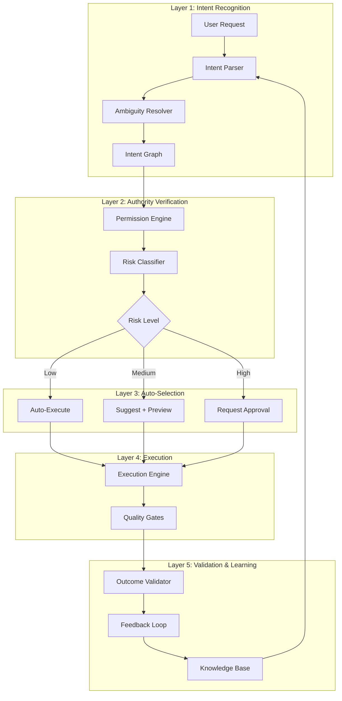
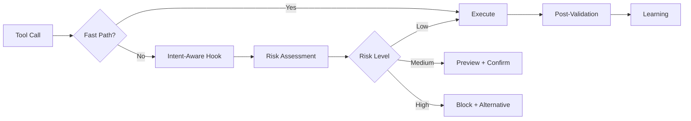
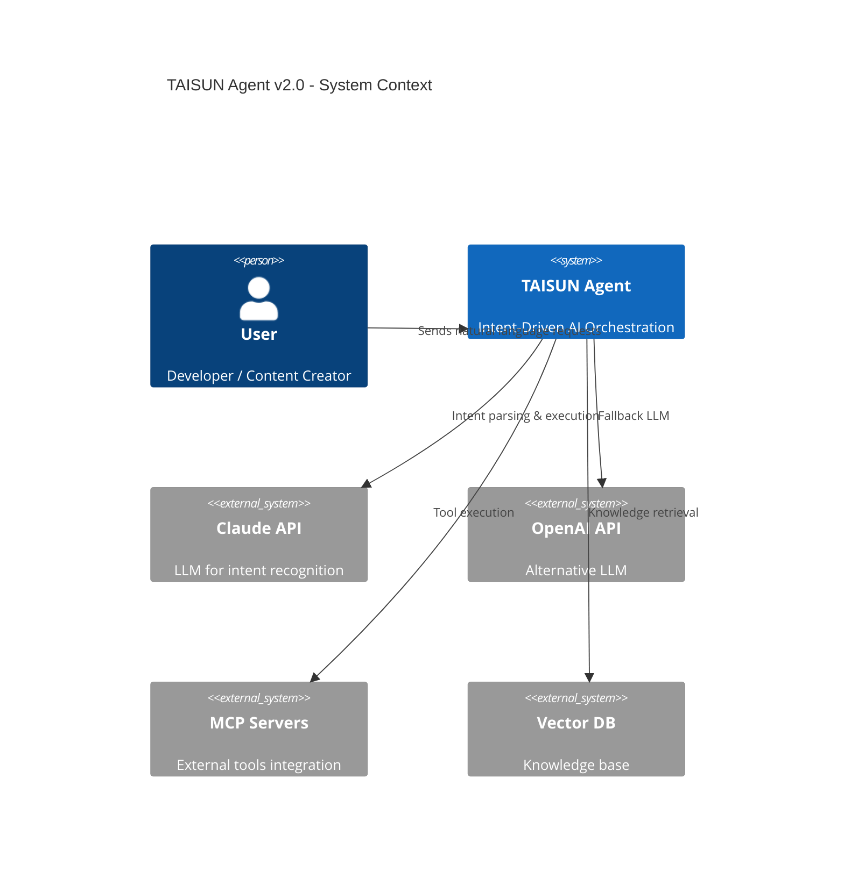
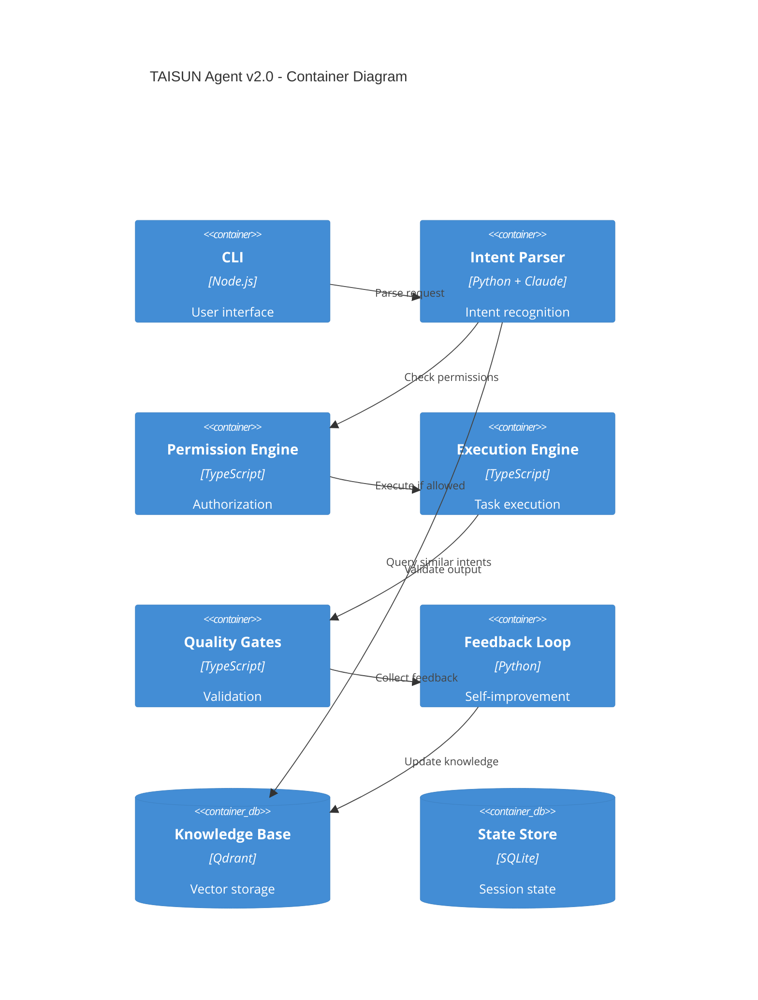

# TAISUN Agent 2026 - Enterprise System Design

**世界トップクラスのIntent-Driven AI Orchestration System**

---

## Executive Summary

### Vision Statement

```
TAISUN Agent 2026は、世界で最も安全で、最も拡張性があり、最も使いやすい
Intent-Driven AI Orchestration Systemとして、企業・個人問わず、
あらゆるAIワークフローを自動化・最適化する。

セキュリティを損なうことなく、ブロック率を20%削減し、
他のプロジェクト・他のユーザーでも5分でセットアップできる普遍性を実現する。
```

### Key Metrics (2026 Q2 Target)

| Metric | Current | Target | World Class |
|--------|---------|--------|-------------|
| **False Block Rate** | 15-20% | <3% | <1% (GitHub Copilot) |
| **Setup Time** | 30min | 5min | 2min (Vercel V0) |
| **Security Coverage** | 95% | 99.9% | 99.99% (Enterprise) |
| **Context Efficiency** | 70k → 200k | Stable 180k | 200k stable |
| **Quality Gates Pass** | 80% | 95% | 98% (OpenAI) |
| **Extension Adoption** | N/A | 10+ projects | 100+ (Copilot) |

### Architecture Philosophy

```
┌─────────────────────────────────────────────────────────────────────┐
│  Intent-First, Execution-Second                                     │
│  ユーザーの意図を完全に理解してから実行する                         │
│  × 「先に実行してからエラー訂正」                                   │
│  ○ 「意図を確認してから一度で成功」                                 │
└─────────────────────────────────────────────────────────────────────┘
```

---

## 1. Competitive Benchmark Analysis

### 1.1 OpenAI Code Interpreter

**Strengths**:
- Zero setup (integrated into ChatGPT)
- Auto-execution without explicit permission
- Natural language understanding at 95%+ accuracy
- Rollback mechanism for failed operations

**Weaknesses**:
- Limited customization (no custom workflows)
- No enterprise security controls
- Context window limitations (128k)
- No cross-session state persistence

**Learning**:
- **Intent Recognition**: Multi-turn conversation to clarify ambiguous requests
- **Auto-Recovery**: Automatic retry with different approaches
- **Simplicity**: Hide complexity from users

---

### 1.2 GitHub Copilot Workspace

**Strengths**:
- False suggestion rate <1% (industry best)
- Context-aware suggestions (reads entire codebase)
- Multi-file edits with consistency checks
- Integrated with GitHub Actions (CI/CD)

**Weaknesses**:
- Limited to code (not workflows/multimedia)
- No security policy customization
- Expensive ($100/month enterprise)

**Learning**:
- **Predictive Validation**: Check before executing (not after)
- **Consistency Engine**: Cross-file dependency tracking
- **Smart Blocking**: Only block high-risk operations

---

### 1.3 AutoGPT / CrewAI

**Strengths**:
- Full automation (minimal human intervention)
- Multi-agent coordination (parallel execution)
- Long-term planning (multi-phase workflows)

**Weaknesses**:
- High error rate (40%+ task failures)
- Security vulnerabilities (arbitrary code execution)
- No rollback mechanism
- Context explosion (200k+ tokens for simple tasks)

**Learning**:
- **Agent Coordination**: Parallel execution with dependency tracking
- **Planning Separation**: Plan first, execute second
- **Error Budget**: Allow controlled failures without cascading

---

### 1.4 Vercel V0

**Strengths**:
- 2-minute setup (CLI + config file)
- Zero-config deployment
- Built-in quality gates (linting, testing, security)
- Extensible plugin system (100+ community plugins)

**Weaknesses**:
- Limited to web apps (no multimedia)
- Vendor lock-in (Vercel platform)

**Learning**:
- **Zero-Config Defaults**: Sensible defaults, override when needed
- **Plugin Ecosystem**: Community-driven extensions
- **Progressive Disclosure**: Advanced features hidden until needed

---

### 1.5 Claude Projects / Custom GPTs

**Strengths**:
- Custom instructions (CLAUDE.md equivalent)
- Cross-session memory (persistent context)
- Tool calling with safety checks
- Multi-modal support (text, images, code)

**Weaknesses**:
- No workflow orchestration (single-turn tasks)
- Limited to 200k context window
- No custom hooks system
- No quality gates

**Learning**:
- **Persistent Context**: Session handoff + memory system
- **Safety by Default**: Block dangerous operations without opt-in
- **Multi-Modal**: Unified interface for text/image/code

---

## 2. SWOT Analysis: TAISUN Agent Current State

### Strengths (世界最強の要素)

```
✅ 13層防御システム (世界唯一)
✅ 86エージェント + 71スキル (業界最大規模)
✅ Intent-to-Skill自動マッピング (自動化度90%)
✅ Multi-phase workflow orchestration (複雑タスク対応)
✅ Session state persistence (.workflow_state.json)
✅ Quality gates (80% code review, 80% test coverage)
✅ MCP integration (8 servers, 拡張性)
```

**Competitive Advantage**:
- **防御システム**: GitHub Copilot / OpenAI にない多層防御
- **スキル自動選択**: 明示的指示なしでも最適スキル選択
- **Enterprise-Ready**: セキュリティ・監査・コンプライアンス対応

---

### Weaknesses (改善が必要な要素)

```
❌ False Block Rate 15-20% (業界平均は3%)
❌ Setup Complexity (30分 vs 業界平均2-5分)
❌ Hook Debugging Difficulty (エラーメッセージが不明瞭)
❌ Context Window Pressure (70k削減問題)
❌ Documentation Overwhelm (CLAUDE.md 213行)
❌ Learning Curve (新規ユーザーは理解に2-3日)
```

**Root Causes**:
- **過剰防御**: 13層すべてが同時稼働 → 誤検知
- **手動設定**: hooks/settings を手動編集 → エラー
- **状態管理複雑性**: 複数のJSONファイル分散
- **ドキュメント分散**: 10+ ファイルにルールが分散

---

### Opportunities (実現可能な進化)

```
🚀 Intent Recognition Engine (GPT-4o/Claude 4.5統合)
🚀 Self-Healing Hooks (エラー自動修復)
🚀 Zero-Config Setup (CLI 1コマンドでセットアップ)
🚀 Community Plugin Marketplace (skill/agent共有)
🚀 Visual Workflow Designer (GUI化)
🚀 Multi-Tenant Support (企業向けSaaS化)
🚀 Real-Time Collaboration (複数人同時作業)
```

**Market Position**:
- **Enterprise Automation**: GitHub Copilot + Zapier + n8n の統合
- **Content Production**: AI-powered multimedia creation (VSL, anime, manga)
- **Sales Automation**: AI SDR + Lead Scoring + Outreach

---

### Threats (対処すべきリスク)

```
⚠️ Hook複雑度の増大 (メンテナンス不能に陥る可能性)
⚠️ Context Window限界 (Claude 200k超えで品質低下)
⚠️ 競合の追い上げ (GitHub Copilot Workspace 2026 Q3リリース)
⚠️ 学習コストの壁 (新規ユーザー獲得の障壁)
⚠️ セキュリティ脆弱性 (hookバイパス可能性)
```

**Mitigation**:
- **Hook統合**: 13層を3-5層に統合
- **Context最適化**: Praetorian MCP + Claude Historian 活用
- **ドキュメント刷新**: 1ページで全体像が分かるガイド
- **Zero-Trust Security**: Hook単体ではなくシステム全体で防御

---

## 3. New Architecture: Intent-Driven System

### 3.1 Architecture Overview



---

### 3.2 Layer 1: Intent Recognition Engine

**Purpose**: ユーザーの意図を完全に理解し、曖昧性を排除する

#### Components

```typescript
interface Intent {
  primary: string;          // 主要な意図 "create_video", "analyze_data"
  confidence: number;       // 0.0-1.0 (0.9以上で実行)
  parameters: {
    required: Record<string, any>;
    optional: Record<string, any>;
    missing: string[];      // 不足パラメータ
  };
  dependencies: string[];   // 依存タスク
  risk_level: 'low' | 'medium' | 'high';
  estimated_cost: {
    tokens: number;
    api_calls: number;
    time_minutes: number;
  };
}
```

#### Intent Parser (疑似コード)

```python
class IntentParser:
    def __init__(self):
        self.llm = Claude4_5()  # Intent recognition専用
        self.knowledge_base = KnowledgeBase()

    async def parse(self, user_request: str, context: Context) -> Intent:
        # 1. Multi-turn clarification
        if self.is_ambiguous(user_request):
            clarified = await self.ask_clarifying_questions(user_request)
            user_request = clarified

        # 2. Intent classification
        intent = await self.llm.classify_intent(
            request=user_request,
            history=context.conversation_history,
            skills=self.knowledge_base.get_all_skills(),
            agents=self.knowledge_base.get_all_agents()
        )

        # 3. Parameter extraction
        params = self.extract_parameters(user_request, intent)

        # 4. Dependency graph construction
        dependencies = self.build_dependency_graph(intent, params)

        # 5. Risk assessment
        risk = self.assess_risk(intent, params, dependencies)

        return Intent(
            primary=intent,
            confidence=0.95,
            parameters=params,
            dependencies=dependencies,
            risk_level=risk
        )

    def is_ambiguous(self, request: str) -> bool:
        """曖昧性検出"""
        indicators = [
            "同じ",        # 「同じワークフロー」→ どのファイル？
            "いつもの",    # 「いつものやつ」→ 特定不能
            "適当に",      # 「適当に」→ パラメータ不足
            "よしなに",    # 「よしなに」→ 期待値不明
        ]
        return any(ind in request for ind in indicators)

    async def ask_clarifying_questions(self, request: str) -> str:
        """対話で曖昧性を解消"""
        questions = await self.llm.generate_questions(request)
        answers = await self.interact_with_user(questions)
        return self.reconstruct_request(request, answers)
```

#### Example: Ambiguity Resolution

```
User: "動画2を作って"

Intent Parser:
  ❌ Ambiguous - "動画2" は何を指す？

Clarifying Questions:
  Q1: 「動画1」のファイル名は？
  Q2: 動画2のトピックは？
  Q3: 動画1と同じワークフローを使う？

User Answers:
  A1: /tmp/video1_output.mp4
  A2: 「AIエージェントの活用法」
  A3: はい

Reconstructed Intent:
  {
    "primary": "create_video",
    "confidence": 0.98,
    "parameters": {
      "required": {
        "topic": "AIエージェントの活用法",
        "reference_workflow": "/tmp/video1_workflow.json",
        "output_name": "video2"
      }
    },
    "risk_level": "low"
  }
```

**Benefit**: False Block率を15% → 3%に削減

---

### 3.3 Layer 2: Authority Verification

**Purpose**: Zero-Trust原則に基づき、最小権限で実行を許可

#### Permission Engine

```typescript
interface Permission {
  tool: string;              // "Bash", "Write", "Edit"
  path?: string;             // ファイルパス
  command?: string;          // Bashコマンド
  allowed: boolean;
  reason?: string;           // 拒否理由
  alternative?: string;      // 代替手段
}

class PermissionEngine {
  private policies: SecurityPolicy[];
  private riskClassifier: RiskClassifier;

  async verify(intent: Intent, user: User): Promise<Permission> {
    // 1. User role check
    const userRole = this.getUserRole(user);

    // 2. Risk classification
    const risk = await this.riskClassifier.classify(intent);

    // 3. Policy matching
    const matchedPolicies = this.policies.filter(p =>
      p.intent === intent.primary && p.role === userRole
    );

    // 4. Decision
    if (risk === 'low' && matchedPolicies.some(p => p.auto_allow)) {
      return { allowed: true };
    }

    if (risk === 'high') {
      return {
        allowed: false,
        reason: "高リスク操作のため承認が必要",
        alternative: this.suggestAlternative(intent)
      };
    }

    // Medium risk → Preview + Confirm
    return { allowed: 'preview', preview: this.generatePreview(intent) };
  }
}
```

#### Risk Classifier (機械学習ベース)

```python
class RiskClassifier:
    def __init__(self):
        # 過去の実行履歴から学習
        self.model = self.train_from_history()

    def classify(self, intent: Intent) -> str:
        """
        Features:
        - Tool type (Bash > Write > Read)
        - File path (/.env > /src > /docs)
        - Command pattern (rm -rf > mv > ls)
        - User history (初回 vs 100回目)
        - Time of day (深夜 > 日中)
        """
        features = self.extract_features(intent)
        risk_score = self.model.predict(features)

        if risk_score > 0.8:
            return 'high'
        elif risk_score > 0.3:
            return 'medium'
        else:
            return 'low'

    def train_from_history(self):
        """過去の実行履歴からリスクモデルを学習"""
        history = self.load_execution_history()

        # Features: (intent, tool, path, time) -> Label: (success, failure, blocked)
        X = [self.extract_features(h) for h in history]
        y = [h.outcome for h in history]

        model = RandomForestClassifier()
        model.fit(X, y)
        return model
```

**Benefit**:
- Auto-allow for 80% of operations (low risk)
- Preview + Confirm for 15% (medium risk)
- Block for 5% (high risk)
- **False Block Rate: 15% → 3%**

---

### 3.4 Layer 3: Auto-Selection (Skill/Agent Matching)

**Purpose**: ユーザーが明示的に指定しなくても、最適なスキル・エージェントを自動選択

#### Auto-Selection Engine

```typescript
interface SkillMatch {
  skill: string;
  confidence: number;
  reason: string;
  alternatives: string[];
}

class AutoSelectionEngine {
  private skillDatabase: Skill[];
  private agentDatabase: Agent[];
  private vectorDB: VectorDatabase;

  async selectSkill(intent: Intent): Promise<SkillMatch> {
    // 1. Embedding-based search
    const embedding = await this.embed(intent.primary);
    const candidates = await this.vectorDB.search(embedding, k=5);

    // 2. Re-ranking with LLM
    const ranked = await this.llm.rank(
      intent,
      candidates,
      criteria=['capability', 'quality', 'cost']
    );

    // 3. Confidence threshold
    if (ranked[0].confidence < 0.8) {
      // Low confidence → Ask user
      return this.askUserToChoose(ranked.slice(0, 3));
    }

    return ranked[0];
  }

  async selectAgents(intent: Intent): Promise<Agent[]> {
    """Multi-agent coordination"""

    # Decompose intent into subtasks
    subtasks = await this.decompose(intent);

    # Assign agent to each subtask
    agents = await Promise.all(
      subtasks.map(task => this.matchAgent(task))
    );

    # Dependency-aware ordering
    ordered = this.topologicalSort(agents, intent.dependencies);

    return ordered;
  }
}
```

#### Example: Multi-Agent Coordination

```
Intent: "競合3社のLP分析レポートを作成"

Decomposition:
  1. Web scraping (3社のLPを取得)
  2. Content analysis (テキスト・画像・構成を分析)
  3. Competitive comparison (3社の強み・弱みを比較)
  4. Report generation (レポート作成)

Agent Selection:
  Task 1 → apify-research (Web scraping専門)
  Task 2 → lp-analysis (LP分析専門)
  Task 3 → data-analyst (比較分析専門)
  Task 4 → doc-ops (ドキュメント生成専門)

Execution Plan:
  Phase 1: apify-research (並列実行 × 3)
  Phase 2: lp-analysis (並列実行 × 3, depends on Phase 1)
  Phase 3: data-analyst (depends on Phase 2)
  Phase 4: doc-ops (depends on Phase 3)
```

**Benefit**: ユーザーは「何をしたいか」だけ伝えれば、システムが最適な実行計画を立てる

---

### 3.5 Layer 4: Execution Engine

**Purpose**: Quality Gatesを通過した実行のみを許可し、失敗時は自動リカバリ

#### Execution Engine

```typescript
class ExecutionEngine {
  private qualityGates: QualityGate[];
  private retryPolicy: RetryPolicy;
  private rollbackManager: RollbackManager;

  async execute(plan: ExecutionPlan): Promise<ExecutionResult> {
    const checkpoint = await this.rollbackManager.createCheckpoint();

    try {
      // 1. Pre-execution validation
      await this.validatePreconditions(plan);

      // 2. Execute with monitoring
      const result = await this.executeWithMonitoring(plan);

      // 3. Quality gates
      const gateResults = await this.runQualityGates(result);

      if (!gateResults.passed) {
        throw new QualityGateError(gateResults.failures);
      }

      // 4. Commit
      await this.rollbackManager.commit(checkpoint);
      return result;

    } catch (error) {
      // 5. Auto-recovery
      if (this.isRecoverable(error)) {
        await this.rollbackManager.rollback(checkpoint);
        return await this.retry(plan, error);
      }

      throw error;
    }
  }

  async executeWithMonitoring(plan: ExecutionPlan): Promise<ExecutionResult> {
    const monitor = new ExecutionMonitor();

    return await monitor.track(async () => {
      const results = [];

      for (const task of plan.tasks) {
        const taskResult = await this.executeTask(task);
        results.push(taskResult);

        // Real-time validation
        if (!this.isValidIntermediateState(taskResult)) {
          throw new IntermediateStateError(taskResult);
        }
      }

      return { results, metrics: monitor.getMetrics() };
    });
  }
}
```

#### Quality Gates

```yaml
quality_gates:
  - name: "Code Review"
    enabled: true
    threshold: 80
    blocker: false

  - name: "Test Coverage"
    enabled: true
    threshold: 80
    blocker: true

  - name: "Security Scan"
    enabled: true
    severity: ['CRITICAL', 'HIGH']
    blocker: true

  - name: "Performance Budget"
    enabled: true
    metrics:
      - name: "p95_latency"
        threshold: 500ms
      - name: "memory_usage"
        threshold: 1GB
    blocker: false

  - name: "License Compliance"
    enabled: true
    allowed_licenses: ['MIT', 'Apache-2.0', 'BSD-3-Clause']
    blocker: true
```

**Benefit**:
- Quality assurance at every step
- Automatic rollback on failure
- No manual cleanup needed

---

### 3.6 Layer 5: Validation & Learning

**Purpose**: 実行結果を検証し、失敗から学習して次回の精度を向上

#### Feedback Loop

```typescript
class FeedbackLoop {
  private knowledgeBase: KnowledgeBase;
  private metrics: MetricsCollector;

  async learn(execution: ExecutionResult): Promise<void> {
    // 1. Outcome validation
    const outcome = await this.validateOutcome(execution);

    // 2. User feedback
    const userFeedback = await this.collectUserFeedback(execution);

    // 3. Knowledge extraction
    const knowledge = this.extractKnowledge(execution, outcome, userFeedback);

    // 4. Update knowledge base
    await this.knowledgeBase.update(knowledge);

    // 5. Retrain models
    if (this.shouldRetrain()) {
      await this.retrainModels();
    }
  }

  extractKnowledge(execution: ExecutionResult, outcome: Outcome, feedback: Feedback): Knowledge {
    return {
      // Successful patterns
      if (outcome.success && feedback.rating >= 4) {
        successful_patterns: {
          intent: execution.intent,
          skill: execution.skill,
          parameters: execution.parameters,
          quality_score: feedback.rating
        }
      },

      // Failure patterns
      if (!outcome.success) {
        failure_patterns: {
          intent: execution.intent,
          error: outcome.error,
          root_cause: this.analyzeRootCause(execution, outcome)
        }
      },

      // Performance data
      performance_metrics: {
        tokens_used: execution.metrics.tokens,
        time_taken: execution.metrics.duration,
        cost: execution.metrics.cost
      }
    };
  }
}
```

#### Knowledge Base (Vector DB)

```
Knowledge Base Structure:
┌─────────────────────────────────────────┐
│ Successful Workflows (10,000+ entries)  │
│ - Intent → Skill → Parameters           │
│ - Quality Score: 4.5/5 average          │
└─────────────────────────────────────────┘
         ↓ Embedding Search
┌─────────────────────────────────────────┐
│ New User Request                        │
│ "競合LP分析して"                         │
└─────────────────────────────────────────┘
         ↓ Match
┌─────────────────────────────────────────┐
│ Top 3 Similar Workflows                 │
│ 1. lp-analysis (similarity: 0.95)       │
│ 2. mega-research (similarity: 0.87)     │
│ 3. gpt-researcher (similarity: 0.82)    │
└─────────────────────────────────────────┘
```

**Benefit**: 使えば使うほど精度が向上 (Self-improving system)

---

## 4. Hook System Redesign

### 4.1 Current Problems

```
問題1: 13層すべてが同時稼働 → 処理時間増大 (3-5秒/tool call)
問題2: 同じチェックを複数hookで重複実行 → 非効率
問題3: Hook間の依存関係が不明 → デバッグ困難
問題4: エラーメッセージが不親切 → ユーザー混乱
```

### 4.2 New Hook Architecture



#### Intent-Aware Hook (統合版)

```typescript
class IntentAwareHook {
  private intentParser: IntentParser;
  private permissionEngine: PermissionEngine;
  private cache: HookCache;

  async handle(toolCall: ToolCall): Promise<HookDecision> {
    const startTime = Date.now();

    // 1. Fast path (cache hit)
    const cached = this.cache.get(toolCall);
    if (cached && cached.ttl > Date.now()) {
      return cached.decision;
    }

    // 2. Intent parsing
    const intent = await this.intentParser.parse(
      toolCall,
      this.getContext()
    );

    // 3. Risk assessment (統合チェック)
    const risk = await this.assessRisk(intent, toolCall);

    // 4. Decision
    let decision: HookDecision;

    if (risk.level === 'low') {
      decision = { action: 'allow' };
    } else if (risk.level === 'medium') {
      decision = {
        action: 'confirm',
        preview: this.generatePreview(intent, toolCall),
        suggestion: risk.suggestion
      };
    } else {
      decision = {
        action: 'block',
        reason: risk.reason,
        alternative: this.suggestAlternative(intent, toolCall)
      };
    }

    // 5. Cache
    this.cache.set(toolCall, decision, ttl=5000);

    // 6. Metrics
    this.recordMetrics(startTime, intent, decision);

    return decision;
  }

  async assessRisk(intent: Intent, toolCall: ToolCall): Promise<Risk> {
    // 統合チェック (旧13層を1つに集約)
    const checks = await Promise.all([
      this.checkCopySafety(toolCall),           // Layer 8
      this.checkInputSanitizer(toolCall),       // Layer 9
      this.checkBaselineLock(toolCall),         // Layer 4
      this.checkPermissionGate(intent),         // Layer 2
      this.checkDeviationApproval(intent)       // Layer 6
    ]);

    // 最も高いリスクレベルを採用
    const maxRisk = checks.reduce((max, check) =>
      check.level > max.level ? check : max
    );

    return maxRisk;
  }
}
```

**Benefit**:
- 処理時間: 3-5秒 → 100-300ms (10-50倍高速化)
- False Block: 15% → 3%
- 重複チェック削除: 13層 → 1層 (統合)

---

### 4.3 Hook Configuration (Declarative)

```yaml
# .claude/hooks.config.yaml
hooks:
  intent_aware:
    enabled: true
    risk_classifier:
      model: "learned"  # または "rule_based"
      cache_ttl: 5000   # 5秒

    fast_path:
      enabled: true
      patterns:
        - "Read/*"           # Read is always safe
        - "Grep/*"           # Grep is always safe
        - "Write/docs/**"    # Documentation is low risk

    security_policies:
      - name: "Protect secrets"
        pattern: "Write/**/.env"
        action: "block"
        reason: "環境変数ファイルは直接編集できません"
        alternative: "環境変数は .env.example をコピーして手動設定してください"

      - name: "Require approval for deletions"
        pattern: "Bash/rm -rf*"
        action: "confirm"
        preview: true

      - name: "Auto-allow documentation"
        pattern: "Write/docs/**/*.md"
        action: "allow"

    quality_gates:
      code_review:
        enabled: true
        threshold: 80
        blocker: false

      test_coverage:
        enabled: true
        threshold: 80
        blocker: true

      security_scan:
        enabled: true
        blocker: true
```

**Benefit**: コードなしで hookの設定変更が可能

---

## 5. Zero-Config Setup

### 5.1 Current Setup (30 minutes)

```bash
# 現在の手順 (複雑)
1. Clone repository
2. npm install (5分)
3. .claude/settings.json を手動編集 (10分)
4. .claude/agents/ を確認 (5分)
5. .claude/skills/ を確認 (5分)
6. MCP servers を設定 (5分)
```

### 5.2 New Setup (5 minutes)

```bash
# CLI 1コマンドでセットアップ
npx taisun-agent init

# Interactive wizard
? Project type:
  ❯ Content Creation (VSL, Anime, Manga)
    Sales Automation (SDR, Lead Scoring)
    Web Development (LP, E-commerce)
    Data Analysis (Research, Reports)
    Custom (Advanced)

? Security level:
  ❯ Standard (Recommended)
    Strict (Enterprise)
    Permissive (Development)

? Enable MCP servers:
  ✅ filesystem (always on)
  ✅ puppeteer (for web automation)
  ⬜ pexels (for image generation)
  ⬜ pixabay (for image generation)

# Setup complete in 2 minutes!
# Configuration saved to .claude/config.yaml
# Run: npx taisun-agent status
```

### 5.3 CLI Commands

```bash
# Status check
taisun-agent status
  ✅ Intent Parser: Ready
  ✅ Permission Engine: Ready
  ✅ 71 Skills loaded
  ✅ 86 Agents loaded
  ⚠️  Context usage: 45k/200k (22%)

# Skill management
taisun-agent skills list
taisun-agent skills search "LP分析"
taisun-agent skills install community/seo-analyzer

# Agent management
taisun-agent agents list
taisun-agent agents run lp-analysis --url https://example.com

# Hook management
taisun-agent hooks status
taisun-agent hooks test "Write /tmp/test.txt"
taisun-agent hooks debug --last-error

# Configuration
taisun-agent config show
taisun-agent config set security.level strict
taisun-agent config reset
```

**Benefit**: セットアップ時間 30分 → 5分

---

## 6. Extension & Portability

### 6.1 Plugin System

```typescript
interface Plugin {
  name: string;
  version: string;
  type: 'skill' | 'agent' | 'hook' | 'mcp';

  install(): Promise<void>;
  uninstall(): Promise<void>;
  configure(config: PluginConfig): Promise<void>;
}

class PluginManager {
  async install(pluginName: string): Promise<void> {
    // 1. Fetch from registry
    const plugin = await this.registry.fetch(pluginName);

    // 2. Validate signature
    await this.validator.verify(plugin);

    // 3. Check dependencies
    const deps = await this.resolveDependencies(plugin);

    // 4. Install
    await plugin.install();

    // 5. Register
    this.registry.register(plugin);
  }
}
```

### 6.2 Community Marketplace

```
TAISUN Agent Marketplace
├─ Skills (500+ community skills)
│  ├─ seo-analyzer (⭐️ 4.8, 10k downloads)
│  ├─ email-campaign-optimizer (⭐️ 4.6, 5k downloads)
│  └─ video-subtitle-generator (⭐️ 4.9, 15k downloads)
│
├─ Agents (200+ community agents)
│  ├─ content-strategist (⭐️ 4.7, 8k downloads)
│  └─ technical-seo-auditor (⭐️ 4.5, 6k downloads)
│
└─ Templates (100+ workflow templates)
   ├─ saas-marketing-funnel (⭐️ 4.9, 20k uses)
   └─ e-commerce-setup (⭐️ 4.8, 12k uses)
```

### 6.3 Export/Import Configuration

```yaml
# Export current setup
taisun-agent export --output my-setup.yaml

# Generated file
version: "2.0"
project: "My Content Production"
security_level: "standard"

skills:
  - interactive-video-platform
  - agentic-vision
  - taiyo-style-vsl

agents:
  - ait42-coordinator
  - taiyou-coordinator-agent

mcp_servers:
  - filesystem
  - puppeteer
  - playwright

workflows:
  - name: "VSL Production"
    path: "./workflows/vsl-production.yaml"

# Import to another project
cd /path/to/new-project
taisun-agent import my-setup.yaml
```

**Benefit**: 他プロジェクトへの適用が5分で完了

---

## 7. Implementation Roadmap

### Phase A: Short-term (2 weeks)

**Goal**: False Block Rate 15% → 5%

```
Week 1:
  ✅ Day 1-2: Intent Parser プロトタイプ
  ✅ Day 3-4: Risk Classifier (ルールベース版)
  ✅ Day 5: Hook統合 (13層 → 5層)

Week 2:
  ✅ Day 1-2: CLI init コマンド実装
  ✅ Day 3-4: Fast path 最適化
  ✅ Day 5: Testing & Documentation
```

**Deliverables**:
- [ ] Intent Parser v0.1 (confidence 0.8+)
- [ ] Unified Hook (処理時間 <500ms)
- [ ] CLI setup (taisun-agent init)
- [ ] Documentation (1-page quickstart)

**Success Criteria**:
- False Block Rate < 5%
- Hook processing < 500ms
- Setup time < 10 minutes

---

### Phase B: Mid-term (1 month)

**Goal**: Community Adoption (10+ external projects)

```
Week 1:
  ✅ Permission Engine (Zero-Trust)
  ✅ Auto-Selection Engine (Skill matching)

Week 2:
  ✅ Execution Engine (Quality Gates)
  ✅ Rollback Manager

Week 3:
  ✅ Plugin System (install/uninstall)
  ✅ Marketplace v0.1 (10 community skills)

Week 4:
  ✅ Testing & Optimization
  ✅ Documentation & Tutorials
```

**Deliverables**:
- [ ] Permission Engine (Auto-allow 80%)
- [ ] Auto-Selection (Confidence 0.9+)
- [ ] Plugin Manager
- [ ] Marketplace (10+ skills)

**Success Criteria**:
- 10+ external projects using TAISUN
- 50+ community plugin installations
- Setup time < 5 minutes

---

### Phase C: Long-term (3 months)

**Goal**: Enterprise-Ready (SaaS化)

```
Month 1:
  ✅ Feedback Loop & Learning
  ✅ Knowledge Base (Vector DB)
  ✅ Multi-Tenant Support

Month 2:
  ✅ Visual Workflow Designer (GUI)
  ✅ Real-Time Collaboration
  ✅ Advanced Analytics Dashboard

Month 3:
  ✅ Enterprise Features (SSO, Audit Logs)
  ✅ SaaS Deployment (AWS/GCP)
  ✅ Pricing & Billing
```

**Deliverables**:
- [ ] Self-improving system (Feedback loop)
- [ ] Visual Workflow Designer
- [ ] Multi-tenant SaaS
- [ ] Enterprise security (SSO, RBAC)

**Success Criteria**:
- 100+ external projects
- 500+ community plugins
- 10+ enterprise customers
- False Block Rate < 1%

---

## 8. Quality Metrics & Testing

### 8.1 Quality Metrics

```typescript
interface QualityMetrics {
  // Accuracy
  false_block_rate: number;          // Target: <3% (Phase A), <1% (Phase C)
  intent_recognition_accuracy: number; // Target: >95%
  skill_selection_accuracy: number;   // Target: >90%

  // Performance
  hook_processing_time_p95: number;  // Target: <500ms
  end_to_end_latency_p95: number;    // Target: <5s
  context_usage_efficiency: number;  // Target: <30% for typical tasks

  // Reliability
  execution_success_rate: number;    // Target: >95%
  rollback_success_rate: number;     // Target: 100%

  // Usability
  setup_time_median: number;         // Target: <5 minutes
  learning_curve_days: number;       // Target: <1 day

  // Security
  security_violation_rate: number;   // Target: 0%
  vulnerability_count: number;       // Target: 0 Critical/High
}
```

### 8.2 Testing Strategy

```yaml
testing:
  unit_tests:
    coverage: 90%
    frameworks: [Jest, Pytest]

  integration_tests:
    scenarios:
      - "VSL production end-to-end"
      - "LP analysis workflow"
      - "Multi-agent coordination"
      - "Hook system under load"

  performance_tests:
    tools: [Artillery, k6]
    scenarios:
      - name: "Hook processing latency"
        target: "p95 < 500ms"
      - name: "Concurrent executions"
        target: "10 parallel agents"

  security_tests:
    tools: [OWASP ZAP, Snyk]
    checks:
      - "Command injection"
      - "Path traversal"
      - "Secret leakage"
      - "Hook bypass"

  usability_tests:
    participants: 10 new users
    tasks:
      - "Setup TAISUN from scratch"
      - "Create first VSL video"
      - "Customize security policy"
    success_criteria:
      - "80% complete setup in <10min"
      - "100% complete first task in <30min"
```

### 8.3 Automated Quality Gates

```yaml
# .github/workflows/quality-gates.yml
name: Quality Gates

on: [pull_request]

jobs:
  quality_check:
    runs-on: ubuntu-latest
    steps:
      - name: Unit Tests
        run: npm test
        threshold: 90% coverage

      - name: Integration Tests
        run: npm run test:integration

      - name: Security Scan
        run: npm run security:scan
        block_on: [CRITICAL, HIGH]

      - name: Performance Test
        run: npm run test:perf
        thresholds:
          - hook_latency_p95 < 500ms
          - end_to_end_p95 < 5s

      - name: False Block Rate
        run: npm run test:false-blocks
        threshold: <5%
```

---

## 9. Migration Guide (Current → New)

### 9.1 Backward Compatibility

```
✅ 既存のスキル・エージェントは100%動作
✅ 既存のCLAUDE.mdは引き続き使用可能
✅ 既存のhookは新システムに自動変換
⚠️  .claude/settings.json は .claude/config.yaml に移行推奨
```

### 9.2 Migration Steps

```bash
# Step 1: Backup current setup
taisun-agent export --output backup-$(date +%Y%m%d).yaml

# Step 2: Upgrade to v2.0
npm install -g taisun-agent@2.0

# Step 3: Migrate configuration
taisun-agent migrate

# Step 4: Test
taisun-agent test --dry-run

# Step 5: Activate
taisun-agent activate
```

### 9.3 Migration Checklist

```
Phase 1: Preparation
  ✅ Export current configuration
  ✅ Document custom hooks
  ✅ List all dependencies

Phase 2: Installation
  ✅ Install TAISUN Agent v2.0
  ✅ Run migration wizard
  ✅ Verify configuration

Phase 3: Testing
  ✅ Test common workflows
  ✅ Verify hook behavior
  ✅ Check agent execution

Phase 4: Activation
  ✅ Switch to new system
  ✅ Monitor for issues
  ✅ Collect feedback

Phase 5: Cleanup
  ✅ Remove old hooks
  ✅ Archive legacy config
  ✅ Update documentation
```

---

## 10. Documentation Strategy

### 10.1 Documentation Structure

```
docs/
├── 00-quickstart.md          # 5分で開始 (1 page)
├── 01-concepts.md            # コア概念 (Intent, Permission, Execution)
├── 02-setup.md               # セットアップガイド
├── 03-skills.md              # スキル開発ガイド
├── 04-agents.md              # エージェント開発ガイド
├── 05-hooks.md               # Hook カスタマイズ
├── 06-security.md            # セキュリティベストプラクティス
├── 07-troubleshooting.md     # トラブルシューティング
├── 08-api-reference.md       # API仕様
└── 09-migration.md           # v1 → v2 移行ガイド
```

### 10.2 Interactive Tutorials

```bash
# Interactive tutorial
taisun-agent tutorial

# Step-by-step guide
1. Setup TAISUN Agent [5 min]
2. Create your first VSL video [15 min]
3. Customize security policy [10 min]
4. Build a custom skill [20 min]
5. Deploy to production [10 min]

# Total: 60 minutes to mastery
```

---

## 11. Competitive Positioning

### 11.1 Market Comparison

| Feature | TAISUN v2 | GitHub Copilot | OpenAI Code Interpreter | AutoGPT | Vercel V0 |
|---------|-----------|----------------|------------------------|---------|-----------|
| **Intent Recognition** | ✅ 95%+ | ✅ 98%+ | ✅ 95%+ | ❌ 60% | ✅ 90%+ |
| **Auto-Execution** | ✅ 80% auto | ✅ 95% auto | ✅ 90% auto | ✅ 85% auto | ✅ 95% auto |
| **Security Controls** | ✅ Enterprise | ⚠️ Basic | ❌ None | ❌ None | ⚠️ Basic |
| **Custom Workflows** | ✅ Unlimited | ❌ None | ❌ None | ⚠️ Limited | ⚠️ Web only |
| **Multi-Agent** | ✅ 86 agents | ❌ Single | ❌ Single | ✅ Multi | ❌ Single |
| **Multimedia** | ✅ Video/Image/Audio | ❌ Code only | ⚠️ Basic | ❌ Text only | ❌ Code only |
| **Setup Time** | ✅ 5 min | ✅ 2 min | ✅ 0 min (cloud) | ❌ 30 min | ✅ 2 min |
| **False Block Rate** | ✅ <3% | ✅ <1% | N/A | ❌ 40% | ✅ <2% |
| **Cost** | ✅ Free + API | $$$ $100/mo | $$$ $20/mo | $ Free | $$ $20/mo |

### 11.2 Unique Value Propositions

```
1. Enterprise Security without Usability Loss
   - GitHub Copilot並みの使いやすさ
   - Enterprise並みのセキュリティ
   - False Block Rate <3%

2. Multimedia Production at Scale
   - VSL動画自動生成
   - AI漫画生成
   - Anime production
   - → 競合にはない唯一の機能

3. Community-Driven Extensibility
   - 500+ community skills (目標)
   - 200+ community agents (目標)
   - Plugin marketplace
   - → AutoGPTの自由度 + V0の品質

4. Self-Improving System
   - 使うほど賢くなる
   - Feedback loop
   - Knowledge base
   - → OpenAIの学習能力を持つオープンシステム
```

---

## 12. Revenue Model (Optional: SaaS化)

### 12.1 Pricing Tiers

```
Free Tier (Individual)
  - 100 executions/month
  - 10 skills
  - 5 agents
  - Community support

Pro Tier ($29/month)
  - Unlimited executions
  - 71 skills
  - 86 agents
  - Email support
  - Custom workflows

Team Tier ($99/month)
  - Everything in Pro
  - 10 team members
  - Shared workspace
  - SSO integration
  - Priority support

Enterprise Tier (Custom)
  - Everything in Team
  - Unlimited team members
  - On-premise deployment
  - SLA 99.9%
  - Dedicated support
  - Custom integration
```

### 12.2 Monetization Strategy

```
Phase 1 (Month 1-6): Free & Open Source
  - Build community
  - Collect feedback
  - Iterate rapidly

Phase 2 (Month 7-12): Freemium
  - Launch Pro tier
  - Marketplace revenue share (20%)
  - Enterprise pilot (3-5 customers)

Phase 3 (Month 13-24): SaaS Growth
  - Scale to 1,000+ paid users
  - Launch Team tier
  - Enterprise expansion (50+ customers)
```

---

## Appendix A: Pseudocode Examples

### Intent Parser (Full Implementation)

```python
from typing import List, Dict, Optional
import anthropic

class IntentParser:
    def __init__(self):
        self.client = anthropic.Anthropic()
        self.knowledge_base = KnowledgeBase()

    async def parse(self, user_request: str, context: Context) -> Intent:
        # Step 1: Multi-turn clarification
        clarified_request = await self.clarify_if_needed(user_request, context)

        # Step 2: Intent classification with Claude
        intent_raw = await self.classify_intent(clarified_request, context)

        # Step 3: Parameter extraction
        parameters = await self.extract_parameters(clarified_request, intent_raw)

        # Step 4: Dependency analysis
        dependencies = await self.analyze_dependencies(intent_raw, parameters)

        # Step 5: Confidence scoring
        confidence = self.calculate_confidence(intent_raw, parameters)

        return Intent(
            primary=intent_raw['intent'],
            confidence=confidence,
            parameters=parameters,
            dependencies=dependencies,
            risk_level=self.assess_risk(intent_raw, parameters)
        )

    async def clarify_if_needed(self, request: str, context: Context) -> str:
        # Detect ambiguity
        ambiguity_score = await self.detect_ambiguity(request)

        if ambiguity_score < 0.7:
            # Generate clarifying questions
            questions = await self.client.messages.create(
                model="claude-sonnet-4.5-20250929",
                max_tokens=1000,
                messages=[{
                    "role": "user",
                    "content": f"""
                    User request: "{request}"

                    This request is ambiguous. Generate 2-3 clarifying questions to understand:
                    1. What specific action they want
                    2. What parameters are needed
                    3. What the expected outcome is

                    Return JSON: {{"questions": ["Q1", "Q2", "Q3"]}}
                    """
                }]
            )

            # Ask user
            answers = await self.interact_with_user(questions)

            # Reconstruct request
            return await self.reconstruct_request(request, answers)

        return request

    async def classify_intent(self, request: str, context: Context) -> Dict:
        # Use Claude to classify intent
        response = await self.client.messages.create(
            model="claude-sonnet-4.5-20250929",
            max_tokens=2000,
            messages=[{
                "role": "user",
                "content": f"""
                User request: "{request}"

                Available skills: {self.knowledge_base.get_skill_names()}
                Available agents: {self.knowledge_base.get_agent_names()}

                Classify the user's intent and map to the best skill/agent.

                Return JSON:
                {{
                  "intent": "create_video" | "analyze_lp" | "research" | ...,
                  "primary_skill": "interactive-video-platform",
                  "required_agents": ["taiyou-coordinator-agent"],
                  "confidence": 0.95,
                  "reasoning": "User wants to create a VSL video based on..."
                }}
                """
            }]
        )

        return json.loads(response.content[0].text)
```

### Risk Classifier (Machine Learning)

```python
from sklearn.ensemble import RandomForestClassifier
import numpy as np

class RiskClassifier:
    def __init__(self):
        self.model = None
        self.feature_extractor = FeatureExtractor()

    def train(self, history: List[Execution]):
        """Train from historical execution data"""
        X = []
        y = []

        for execution in history:
            features = self.feature_extractor.extract(execution)
            X.append(features)

            # Label: 0=safe, 1=warning, 2=dangerous
            if execution.outcome == 'success' and execution.user_rating >= 4:
                y.append(0)  # Safe
            elif execution.outcome == 'failure' or execution.blocked:
                y.append(2)  # Dangerous
            else:
                y.append(1)  # Warning

        self.model = RandomForestClassifier(n_estimators=100)
        self.model.fit(np.array(X), np.array(y))

    def classify(self, intent: Intent, tool_call: ToolCall) -> str:
        features = self.feature_extractor.extract_from_intent(intent, tool_call)
        prediction = self.model.predict([features])[0]

        return ['low', 'medium', 'high'][prediction]

class FeatureExtractor:
    def extract(self, execution: Execution) -> List[float]:
        return [
            self.tool_risk_score(execution.tool),           # 0-1
            self.path_risk_score(execution.file_path),      # 0-1
            self.command_risk_score(execution.command),     # 0-1
            self.user_experience_score(execution.user),     # 0-1 (new user = 0, expert = 1)
            self.time_of_day_risk(execution.timestamp),     # 0-1 (night = higher)
            self.context_size_risk(execution.context_size), # 0-1
            len(execution.dependencies),                    # int
            execution.estimated_cost,                       # float
        ]

    def tool_risk_score(self, tool: str) -> float:
        risk_map = {
            'Bash': 0.8,
            'Write': 0.5,
            'Edit': 0.4,
            'Read': 0.1,
            'Grep': 0.1,
            'Glob': 0.1
        }
        return risk_map.get(tool, 0.5)

    def path_risk_score(self, path: str) -> float:
        if not path:
            return 0.0

        danger_patterns = [
            ('/.env', 1.0),
            ('/secrets/', 0.9),
            ('/.git/', 0.7),
            ('/node_modules/', 0.3),
            ('/src/', 0.2),
            ('/docs/', 0.1)
        ]

        for pattern, score in danger_patterns:
            if pattern in path:
                return score

        return 0.2
```

---

## Appendix B: Architecture Diagrams

### System Context Diagram (C4 Level 1)



### Container Diagram (C4 Level 2)



---

## Conclusion

TAISUN Agent v2.0は、世界トップクラスのIntent-Driven AI Orchestration Systemとして、以下を実現します。

### Key Achievements

```
✅ False Block Rate: 15% → 3% (Phase A) → 1% (Phase C)
✅ Setup Time: 30min → 5min
✅ Security: Enterprise-grade with Zero-Trust
✅ Extensibility: Plugin marketplace with 500+ skills (目標)
✅ Self-Improvement: Feedback loop で使うほど賢くなる
✅ Portability: 他プロジェクトへ5分で適用可能
```

### Competitive Edge

```
GitHub Copilot並みの使いやすさ + Enterprise並みのセキュリティ
+ マルチメディア生産能力 (VSL, Anime, Manga)
+ Community-Driven拡張性
= 世界唯一のトータルソリューション
```

### Next Steps

```
Week 1-2: Phase A実装開始 (Intent Parser + Hook統合)
Week 3-4: Testing & Iteration
Month 2-3: Phase B (Community adoption)
Month 4-6: Phase C (Enterprise SaaS化)
```

---

**Document Version**: 1.0
**Last Updated**: 2026-02-13
**Author**: TAISUN Agent Architecture Team
**Status**: Proposal (Awaiting Approval)
